# Destroyer Design Proposals (Stage A)

**Star Fox: Ascent** — Space Station Mission Boss Redesign  
Collection file: `models/destroyer/source/concepts/destroyer_concepts.blend`

---

## Overview

In accordance with the Stage A brief in [models/SPACE_ASSETS.md](../../SPACE_ASSETS.md), four distinct rough blockout proposals have been created from scratch for the Venom capital ship destroyer. None of these designs are based on the legacy split-wedge ship. Each explores a fundamentally different silhouette, faction expression, tactical gameplay loop, and spatial layout, while strictly adhering to all technical and gameplay constraints:

- **True Game Scale:** All concepts are 680–750 m long, 330–350 m wide, and 110–170 m tall.
- **Warp Portal Compliance:** Every concept's maximum cross-section (seen from the bow) fits comfortably inside a circle of 220 m radius centred at $(0, 0, 30)$ in the $X\text{-}Z$ plane.
- **Unified World Origin:** World origin at $(0, 0, 0)$ on the centerline, roughly amidships, at the base level of the hull underside.
- **Distinct Destructible Part Objects:** Separate objects with correct local pivots and required nomenclature:
  - `<Letter>_Bridge` (targeted as a ~50 m radius sphere, elevated and visible from afar)
  - `<Letter>_Thruster_1..3` (3 glowing nozzles facing aft, origins at nozzle centres, targeted as ~30 m radius spheres)
  - `<Letter>_HangarDoor_L` and `<Letter>_HangarDoor_R` ($78 \times 36\text{ m}$ flat slabs, origin at door centre, sliding vertically up with dedicated clearance)
  - `<Letter>_TurretMount_1..8` (flat $10\text{ m}$ discs with open sky above)
  - `<Letter>_Hull` (primary and secondary hull volumes composed of clean, convex-decomposable geometry)
- **Polygon Budget:** All concepts use between 1,070 and 1,210 triangles, well under the 10,000 triangle Stage A budget.
- **Venom Faction Materials:** Standard flat toon palette with outward-facing normals, backface culling enabled, and glowing emissive cores.

---

## Concept A: Manticore (`Concept_A_Manticore`)

> **Pitch:** Heavy Prow Spearhead — an aggressive, predatory trident capital ship with forward-swept wing outriggers and an imposing central armored beak.

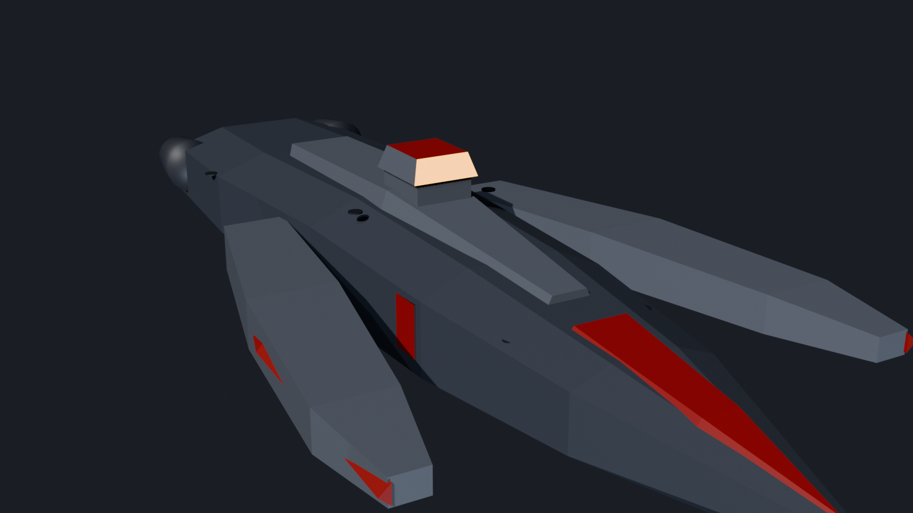

### Form & Silhouette
*Manticore* evokes predatory speed, aggressive hunting, and piercing shock-assault doctrine. A heavy central fuselage culminates in a vicious downward-sloped spearhead beak at the bow, flanked by two massive forward-swept outrigger armor sponsons that reach forward like mantis claws. From 3 km away, its forward-reaching trident silhouette reads immediately as hostile, dangerous, and completely distinct from the Great Fox's swept-back carrier wings and the Space Station's central wheel.

### Dimensions & Metrics
- **Length:** 715.0 m (Hull Y: -335.0 to +360.0 m; Thrusters reach Y: -355.0 m)
- **Width:** 350.0 m (Outrigger claw tips at X = $\pm 175.0\text{ m}$)
- **Height:** 109.5 m (Keel at Z = -15.0 m to Bridge roof at Z = +94.5 m)
- **Triangle Count:** 1,128 triangles (Hull: 240, Bridge: 24, Doors: 24, Thrusters: 360, Turret Mounts: 480)
- **Warp Portal Clearance:** Maximum radial distance to $(0, 0, 30)$ is **175.9 m** (portal radius limit: 220 m; margin: 44.1 m).

### Part Layout & Combat Gameplay
- **Bridge (`A_Bridge`):** Perched at $(0.0, -20.0, 94.0)$ atop the stepped mid-dorsal cathedral spine. Features a glowing amber forward observation gallery under a swept crimson cowl roof.
  - *Attack Lines & Cover:* High dorsal placement grants clear approach lines for high-altitude bombing passes from the front and flanks. Attacking from below requires looping around the ventral keel.
  - *Turret Coverage:* Guarded directly by dorsal flank turrets 5 & 6 at $(\pm 52.0, -25.0, 72.0)$. Players must knock out these turrets or hug the wing sponson trenches to evade flak fire.
- **Thrusters (`A_Thruster_1..3`):** Protrude 20 m beyond the rear transom at $Y = -355.0\text{ m}$.
  - Thruster 1 (Center): $(0.0, -355.0, 24.0)$, outer radius 22 m, inner core 17 m.
  - Thrusters 2 & 3 (Port/Starboard): $(\pm 70.0, -355.0, 36.0)$, outer radius 18 m, inner core 14 m.
  - *Attack Lines & Cover:* Fully exposed from the rear hemisphere. Approaching dead-astern gives line-of-sight to all three glowing exhaust nozzles.
  - *Turret Coverage:* Covered by aft sponson turrets 7 & 8 at $(\pm 82.0, -230.0, 52.0)$.
- **Hangar Doors (`A_HangarDoor_L`, `A_HangarDoor_R`):** Set into the vertical fuselage sidewalls at $(\pm 65.0, 45.0, 28.0)$, recessed 24 m deep.
  - *Operation:* Sits over a 24 m deep hangar bay. Slides vertically up along the sidewall, which extends to Z = 76 m (providing 30 m of clean vertical clearance).
  - *Attack Lines:* Sheltered beneath the forward-swept outrigger wings. Players can fly through the 50 m wide longitudinal wing channel on a strafing run to destroy the doors as fighters deploy, using the outrigger wing as cover against high-angle dorsal turret fire.
- **Turret Mounts (`A_TurretMount_1..8`):**
  - Mounts 1 & 2: $(\pm 152.0, 220.0, 42.0)$ on forward outrigger claw tips (forward arc coverage).
  - Mounts 3 & 4: $(\pm 46.0, 160.0, 48.0)$ on forward beak shoulders.
  - Mounts 5 & 6: $(\pm 52.0, -25.0, 72.0)$ flanking the command bridge.
  - Mounts 7 & 8: $(\pm 82.0, -230.0, 52.0)$ on aft engine nacelles.
  - *Blind Spots:* Deep ventral keel and underside of the outrigger channels have zero turret coverage, providing safe transit routes for the player to regroup.

### Colour Palette
- `Destroyer_Hull`: Dark gunmetal grey $(0.20, 0.22, 0.26)$
- `Destroyer_HullLight`: Elevated dorsal spine & outriggers $(0.32, 0.34, 0.38)$
- `Destroyer_HullDark`: Ventral keel & recess channels $(0.13, 0.14, 0.17)$
- `Destroyer_Crimson`: Prow beak crest & outrigger claw blades $(0.55, 0.04, 0.05)$
- `Destroyer_Dark`: Hangar bays & door borders $(0.07, 0.07, 0.09)$
- `Destroyer_Window`: Amber observation visors $(1.0, 0.65, 0.20$, emission 4)
- `Destroyer_EngineGlow`: Exhaust nozzles $(1.0, 0.35, 0.10$, emission 6)
- `Destroyer_TurretMount`: Flak mount pads $(0.10, 0.11, 0.13)$

### Risks & Open Questions
The forward-swept outriggers create two longitudinal flight channels (~50 m wide). While spacious for the player's 6 m fighter, AI obstacle avoidance proxy spheres will need careful placement along the outrigger booms so wingmen do not snag when maneuvering in tight dogfights.

| Orthographic Side | Orthographic Top |
| :---: | :---: |
| 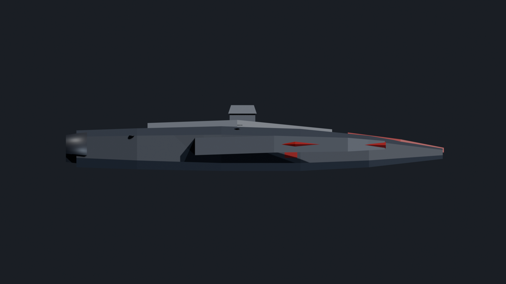 | 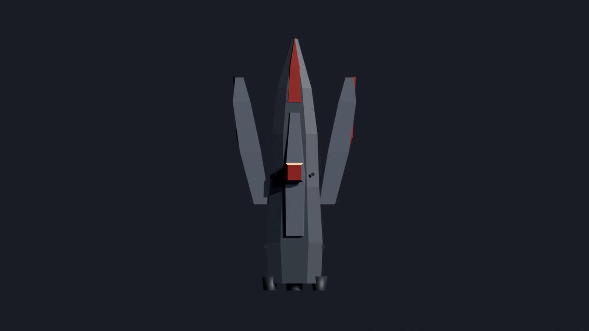 |
| **Aft Thrusters** | **Scale Comparison (vs Current)** |
| 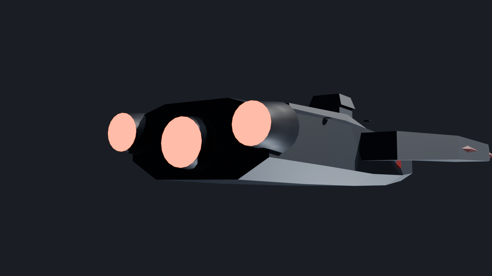 |  |

---

## Concept B: Gorgon (`Concept_B_Gorgon`)

> **Pitch:** Monolithic Iron Fortress — an oppressive, brutalist dreadnought with tiered armor terraces and an imposing command citadel.

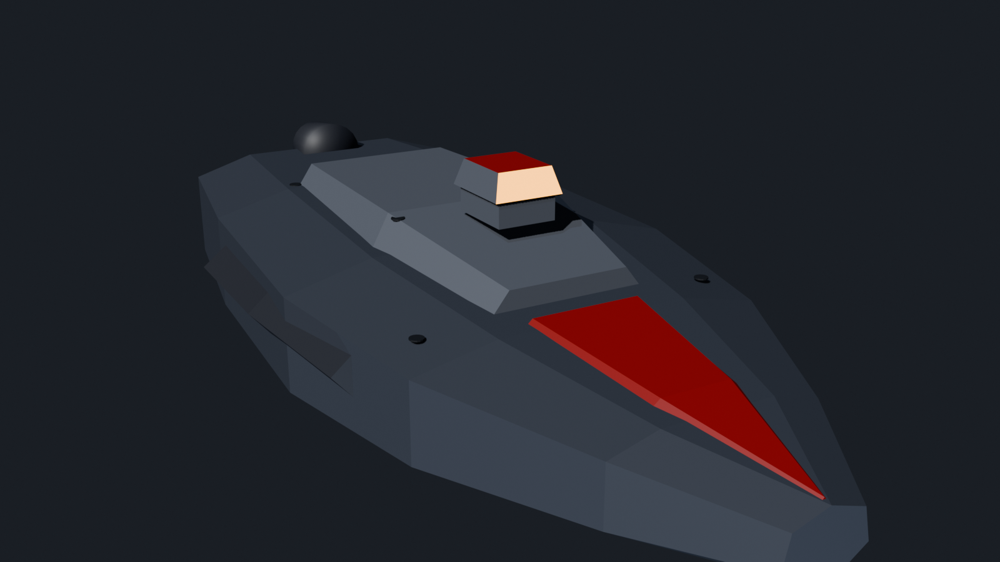

### Form & Silhouette
*Gorgon* evokes crushing mass, impenetrable heavy armor, and industrial totalitarian warfare. Built like a monolithic space dreadnought, its prow forms a heavy wedge-shaped deflection glacis that widens into stepped armor terraces rising toward a towering mid-forward command citadel. It conveys the feeling of an unyielding battering ram that shrugs off laser fire.

### Dimensions & Metrics
- **Length:** 687.0 m (Hull Y: -325.0 to +345.0 m; Thrusters reach Y: -342.0 m)
- **Width:** 336.0 m (Flank bulwarks at X = $\pm 168.0\text{ m}$)
- **Height:** 126.0 m (Keel at Z = -20.0 m to Citadel roof at Z = +116.0 m; Overall: ~136 m)
- **Triangle Count:** 1,072 triangles (Hull: 184, Bridge: 24, Doors: 24, Thrusters: 360, Turret Mounts: 480)
- **Warp Portal Clearance:** Maximum radial distance to $(0, 0, 30)$ is **168.0 m** (portal radius limit: 220 m; margin: 52.0 m).

### Part Layout & Combat Gameplay
- **Bridge (`B_Bridge`):** Heavy command citadel at $(0.0, 30.0, 116.0)$, rising from the forward-mid superstructure terraces. Monolithic pagoda silhouette with multi-tiered amber observation slits and a crimson brow shield.
  - *Attack Lines & Cover:* High forward position makes it the premier landmark when approaching from the bow. Approaching from dead-aft is blocked by the higher aft terrace steps, requiring players to pull into a high climb before diving onto the citadel.
  - *Turret Coverage:* Directly shielded by citadel flank bastions 5 & 6 at $(\pm 65.0, -10.0, 94.0)$.
- **Thrusters (`B_Thruster_1..3`):** Arranged in an iconic triangular/pyramidal cluster at $Y = -342.0\text{ m}$.
  - Thruster 1 (Upper Center): $(0.0, -342.0, 74.0)$, outer radius 22 m.
  - Thrusters 2 & 3 (Lower Port/Starboard): $(\pm 65.0, -342.0, 20.0)$, outer radius 19 m.
  - *Attack Lines & Cover:* The triangular layout creates tactical depth: players can hit the lower pair on a single horizontal strafing pass, but must reposition vertically to attack the upper engine.
  - *Turret Coverage:* Guarded by aft terrace turrets 7 & 8 at $(\pm 75.0, -190.0, 78.0)$.
- **Hangar Doors (`B_HangarDoor_L`, `B_HangarDoor_R`):** Set into sheer vertical armored flank bulwarks at $(\pm 135.0, -40.0, 22.0)$, over 24 m deep bays.
  - *Operation:* Slides vertically up along the sheer flank wall (which extends to Z = 74 m, providing 34 m of overhead clearance).
  - *Attack Lines:* Midship waist placement requires broadside approach runs along the ship's flanks.
- **Turret Mounts (`B_TurretMount_1..8`):**
  - Mounts 1 & 2: $(\pm 48.0, 230.0, 42.0)$ on forward prow glacis steps.
  - Mounts 3 & 4: $(\pm 110.0, 110.0, 56.0)$ on midship lower barbettes.
  - Mounts 5 & 6: $(\pm 65.0, -10.0, 94.0)$ on citadel flank bastions.
  - Mounts 7 & 8: $(\pm 75.0, -190.0, 78.0)$ on aft superstructure terraces.
  - *Blind Spots:* Flat ventral keel area and high 90° overhead dive directly over the citadel roof.

### Colour Palette
- `Destroyer_Hull`: Monolithic gunmetal hull $(0.20, 0.22, 0.26)$
- `Destroyer_HullLight`: Superstructure terraces $(0.32, 0.34, 0.38)$
- `Destroyer_HullDark`: Flank bulwarks & lower keel $(0.13, 0.14, 0.17)$
- `Destroyer_Crimson`: Heavy prow deflection glacis & citadel roof $(0.55, 0.04, 0.05)$
- `Destroyer_Dark`: Hangar bays & vents $(0.07, 0.07, 0.09)$
- `Destroyer_Window`: Citadel visors $(1.0, 0.65, 0.20$, emission 4)
- `Destroyer_EngineGlow`: Exhaust nozzles $(1.0, 0.35, 0.10$, emission 6)
- `Destroyer_TurretMount`: Barbette mount discs $(0.10, 0.11, 0.13)$

### Risks & Open Questions
The citadel's solid base shields the bridge from low-angle aft attacks, forcing players to climb high over the aft deck to reacquire target lock. This provides good flight challenge but requires clear comms lines (e.g. Falco: *"The citadel's covered from behind! Hit it from above!"*).

| Orthographic Side | Orthographic Top |
| :---: | :---: |
| 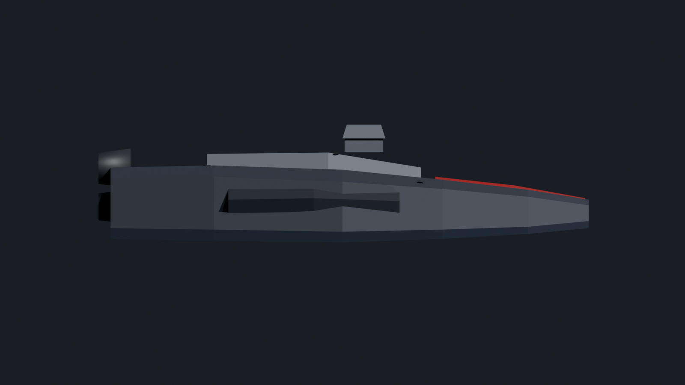 | 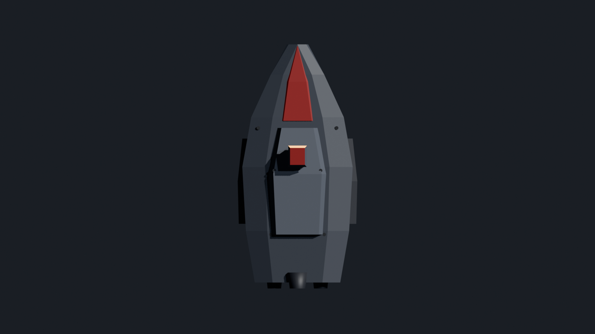 |
| **Aft Thrusters** | **Scale Comparison (vs Current)** |
| 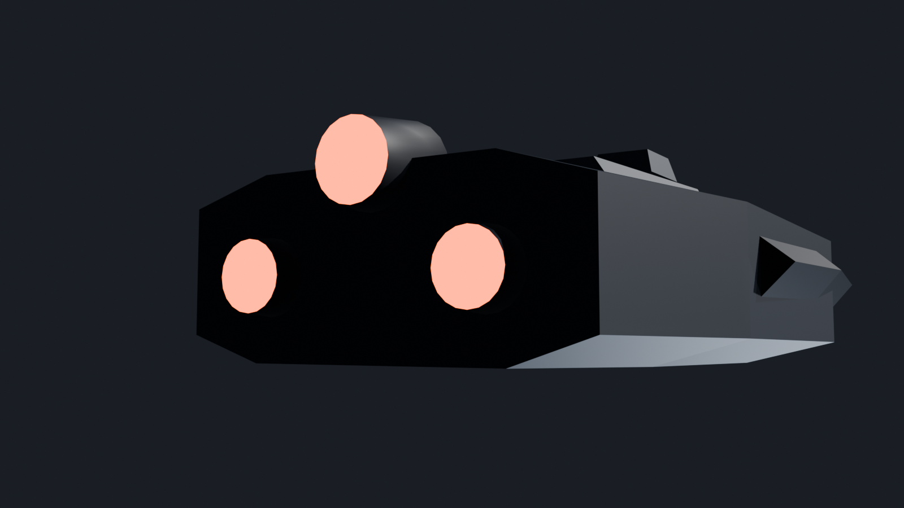 | 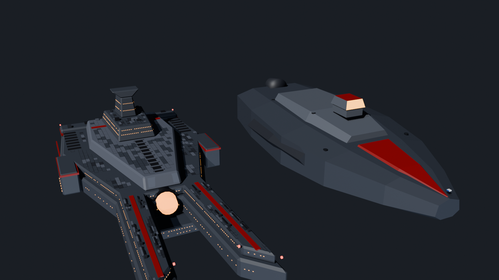 |

---

## Concept C: Ouroboros (`Concept_C_Ouroboros`)

> **Pitch:** Hollow Ring-Spindle Destroyer — an iconic capital ship featuring a massive open fly-through void along its central axis, crowned by a majestic dorsal bridge arch.

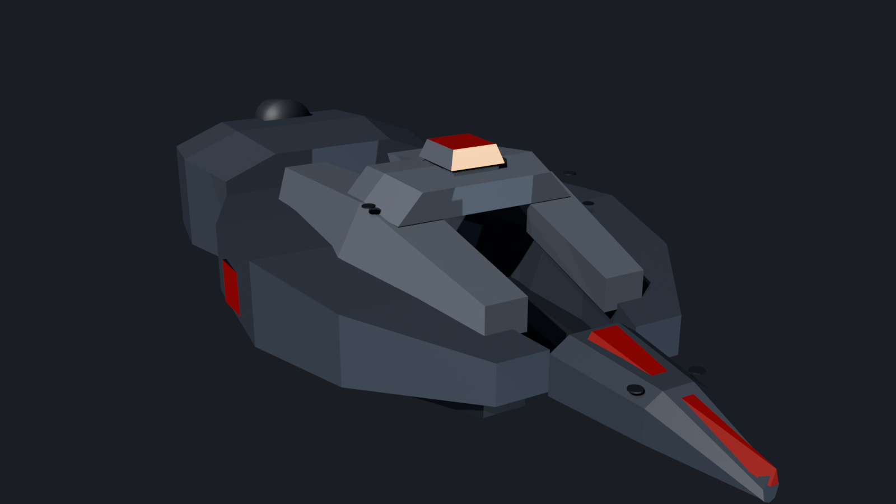

### Form & Silhouette
*Ouroboros* introduces a breathtaking sci-fi silhouette: a hollow ring-spindle cruiser. A sharp forward prow ram splits into sweeping port and starboard ring arches that loop around a massive central fly-through void before fusing into the heavy aft propulsion collar. This fulfills the brief's invitation for a signature flight set piece: a **$110\text{ m wide} \times 65\text{ m tall}$ clear tunnel running right through the ship's center**, inviting players to barrel-roll straight through the boss during combat.

### Dimensions & Metrics
- **Length:** 730.0 m (Hull Y: -345.0 to +365.0 m; Thrusters reach Y: -365.0 m)
- **Width:** 330.0 m (Lateral ring sponsons at X = $\pm 165.0\text{ m}$)
- **Height:** 166.0 m (Ventral keel arch Z = -42.0 m to Bridge roof Z = +126.0 m; Overall: ~170 m)
- **Fly-Through Void:** $110\text{ m wide} \times 65\text{ m tall}$ unobstructed central channel running from $Y = +180\text{ m}$ to $Y = -180\text{ m}$.
- **Triangle Count:** 1,204 triangles (Hull: 316, Bridge: 24, Doors: 24, Thrusters: 360, Turret Mounts: 480)
- **Warp Portal Clearance:** Maximum radial distance to $(0, 0, 30)$ is **169.3 m** (portal radius limit: 220 m; margin: 50.7 m).

### Part Layout & Combat Gameplay
- **Bridge (`C_Bridge`):** Elevated atop the transverse dorsal bridge arch at $(0.0, 40.0, 126.0)$. Panoramic $360^\circ$ observation gallery with amber visor slits and crimson crown.
  - *Attack Lines & Cover:* Towering at Z = 126 m, it is visible from the entire sector. Unobstructed approach from above. Attacking from directly below is impossible because the arch floor blocks line-of-sight; however, boosting through the central void and pulling straight up in an immelmann turn behind the bridge creates an incredible ace attack run!
  - *Turret Coverage:* Guarded by upper ring shoulder turrets 3 & 4 at $(\pm 88.0, 60.0, 108.0)$.
- **Thrusters (`C_Thruster_1..3`):** Protrude at $Y = -365.0\text{ m}$ from the aft propulsion collar:
  - Thruster 1 (Upper Hub): $(0.0, -365.0, 82.0)$, outer radius 22 m.
  - Thrusters 2 & 3 (Lower Pylons): $(\pm 75.0, -365.0, -5.0)$, outer radius 19 m.
  - *Attack Lines & Cover:* Wide vertical separation between upper and lower engines prevents wiping all three in one trivial pass, requiring multiple attack runs.
  - *Turret Coverage:* Guarded by stern collar shoulder turrets 7 & 8 at $(\pm 65.0, -240.0, 72.0)$.
- **Hangar Doors (`C_HangarDoor_L`, `C_HangarDoor_R`):** Embedded on the outer lateral ring bulges at $(\pm 160.0, -20.0, 25.0)$, recessed 24 m deep.
  - *Operation:* Slides vertically up along the outer ring sidewall (which rises to Z = 68 m, providing 32 m clearance).
  - *Attack Lines:* Broadside orbits around the ship's outer perimeter.
- **Turret Mounts (`C_TurretMount_1..8`):**
  - Mounts 1 & 2: $(\pm 24.0, 280.0, 46.0)$ on forward ram spine.
  - Mounts 3 & 4: $(\pm 88.0, 60.0, 108.0)$ on upper ring shoulders.
  - Mounts 5 & 6: $(\pm 150.0, -40.0, 15.0)$ on lower outer ring sponsons.
  - Mounts 7 & 8: $(\pm 65.0, -240.0, 72.0)$ on stern propulsion collar.
  - *Signature Feature (The Fly-Through Void):* Flying through the interior void provides complete cover from all exterior turrets! The interior void functions as an evasion sanctuary where players can break enemy missile locks or lose pursuing fighters.

### Colour Palette
- `Destroyer_Hull`: Dark ring hull $(0.20, 0.22, 0.26)$
- `Destroyer_HullLight`: Dorsal bridge arch $(0.32, 0.34, 0.38)$
- `Destroyer_HullDark`: Ventral keel arch $(0.13, 0.14, 0.17)$
- `Destroyer_Crimson`: Forward ram blade & bridge roof $(0.55, 0.04, 0.05)$
- `Destroyer_Dark`: Hangar bays $(0.07, 0.07, 0.09)$
- `Destroyer_Window`: Bridge visors $(1.0, 0.65, 0.20$, emission 4)
- `Destroyer_EngineGlow`: Exhaust nozzles $(1.0, 0.35, 0.10$, emission 6)
- `Destroyer_TurretMount`: Turret pads $(0.10, 0.11, 0.13)$

### Risks & Open Questions
AI wingmen and enemy fighters must navigate around the ring structure without crashing. Because the void is 110 m wide and 65 m tall (more than triple the wingman formation radius), avoidance proxy spheres can cleanly wrap the upper and lower arches while leaving the central axis open, or AI can simply steer around the exterior bounding envelope while the player uses the void as an ace set piece.

| Orthographic Side | Orthographic Top |
| :---: | :---: |
| 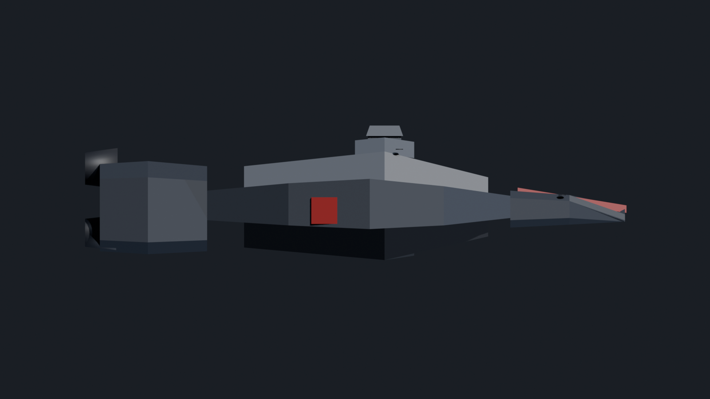 | 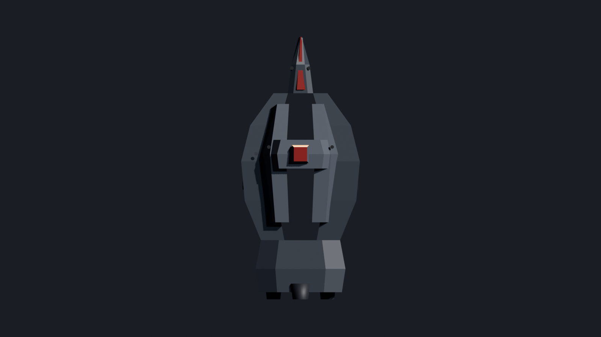 |
| **Aft Thrusters** | **Scale Comparison (vs Current)** |
| 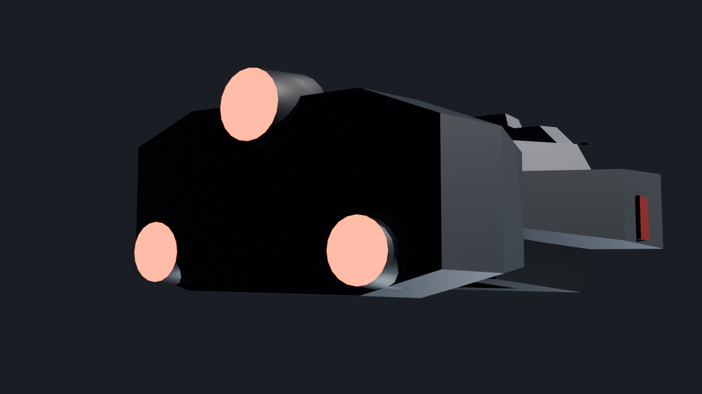 | 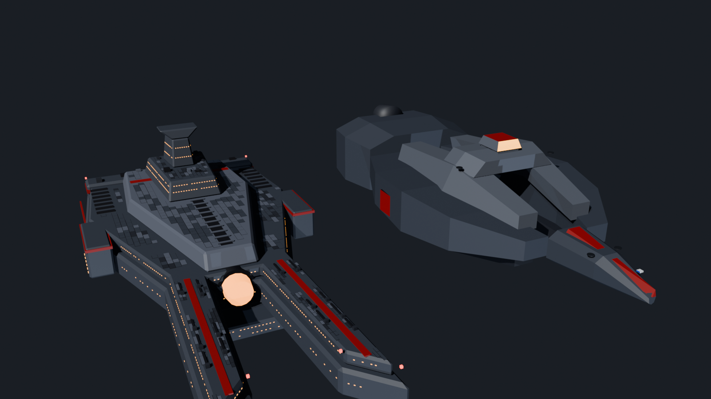 |

---

## Concept D: Stryker (`Concept_D_Stryker`)

> **Pitch:** Arthropod Mandible Carrier — a biomechanical Venom strike cruiser featuring vicious forward pincers, a segmented chitin carapace, and wasp-tail propulsion.

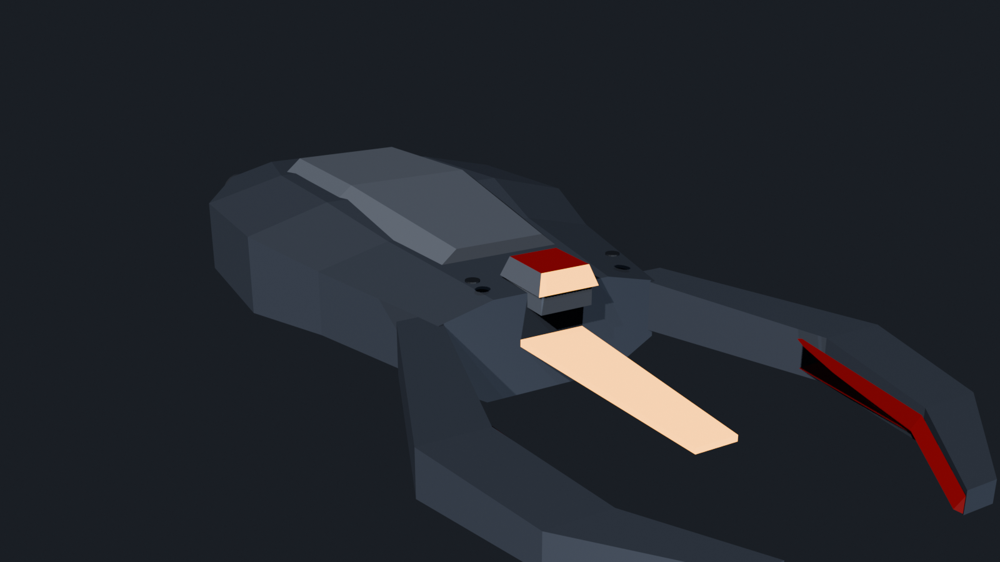

### Form & Silhouette
*Stryker* embraces the insectile biomechanical aesthetic of Venom's fleet, echoing the Mantis fighters, the classic boss designs, and bio-organic menace. Two massive forward pincer mandibles curve inward at the bow, framing an amber spinal energy gullet that leads directly to an armored ocular head bridge. A segmented thoracic carapace and tapered wasp-tail stern give it an unmistakable arthropod predator silhouette.

### Dimensions & Metrics
- **Length:** 750.0 m (Hull Y: -355.0 to +375.0 m; Thrusters reach Y: -375.0 m)
- **Width:** 330.0 m (Mandible elbows at X = $\pm 165.0\text{ m}$)
- **Height:** 114.2 m (Keel at Z = -15.0 m to Thoracic brow at Z = +85.0 m; Overall: ~115 m)
- **Triangle Count:** 1,104 triangles (Hull: 216, Bridge: 24, Doors: 24, Thrusters: 360, Turret Mounts: 480)
- **Warp Portal Clearance:** Maximum radial distance to $(0, 0, 30)$ is **166.0 m** (portal radius limit: 220 m; margin: 54.0 m).

### Part Layout & Combat Gameplay
- **Bridge (`D_Bridge`):** Armored ocular head capsule at $(0.0, 85.0, 66.0)$, nestled directly between the roots of the forward mandibles. Features multi-faceted amber compound-eye visor bands under a swept crimson chitin brow shield.
  - *Attack Lines & Cover:* Frontal approaches require flying straight into the jaws of the mandibles! The pincer arms provide physical cover from the sides, forcing players to either dive from high above or fly through the 80 m wide mandible trench on an adrenaline-charged attack run.
  - *Turret Coverage:* Flanked by thoracic shoulder turrets 3 & 4 at $(\pm 55.0, 80.0, 74.0)$.
- **Thrusters (`D_Thruster_1..3`):** Protrude at $Y = -375.0\text{ m}$ from the tapered wasp-tail stern in a horizontal triple-pod array:
  - Thruster 1 (Center): $(0.0, -375.0, 28.0)$, outer radius 21 m.
  - Thrusters 2 & 3 (Port/Starboard): $(\pm 66.0, -375.0, 28.0)$, outer radius 18 m.
  - *Attack Lines & Cover:* Tightly clustered horizontal array. A skilled player can sweep across all three nozzles in a single high-speed horizontal strafing pass.
  - *Turret Coverage:* Guarded by rear carapace crest turrets 7 & 8 at $(\pm 52.0, -230.0, 68.0)$.
- **Hangar Doors (`D_HangarDoor_L`, `D_HangarDoor_R`):** Set into the constricted waist flank bays between the thorax and abdomen at $(\pm 110.0, -65.0, 24.0)$, recessed 24 m deep.
  - *Operation:* Slides vertically up along the abdominal flank wall (which rises to Z = 66 m, providing 30 m clearance).
  - *Attack Lines:* Sheltered in the waist indentations. Approaching requires rolling into the waist recess.
- **Turret Mounts (`D_TurretMount_1..8`):**
  - Mounts 1 & 2: $(\pm 115.0, 250.0, 32.0)$ on forward mandible pincer arms (forward crossfire).
  - Mounts 3 & 4: $(\pm 55.0, 80.0, 74.0)$ on thoracic brow shoulders.
  - Mounts 5 & 6: $(\pm 88.0, -75.0, 54.0)$ on abdominal waist sponsons.
  - Mounts 7 & 8: $(\pm 52.0, -230.0, 68.0)$ on rear carapace crest.
  - *Glowing Spinal Gullet:* A glowing amber energy trench runs down between the mandibles toward the head bridge, acting as a visual runway guiding the player straight into the boss's face.

### Colour Palette
- `Destroyer_Hull`: Dark chitinous grey $(0.20, 0.22, 0.26)$
- `Destroyer_HullLight`: Segmented dorsal carapace $(0.32, 0.34, 0.38)$
- `Destroyer_HullDark`: Ventral chitin underbelly $(0.13, 0.14, 0.17)$
- `Destroyer_Crimson`: Mandible fang edges & head brow $(0.55, 0.04, 0.05)$
- `Destroyer_Dark`: Hangar waist bays $(0.07, 0.07, 0.09)$
- `Destroyer_Window`: Ocular visors & spinal energy trench $(1.0, 0.65, 0.20$, emission 4)
- `Destroyer_EngineGlow`: Exhaust nozzles $(1.0, 0.35, 0.10$, emission 6)
- `Destroyer_TurretMount`: Flak mount pads $(0.10, 0.11, 0.13)$

### Risks & Open Questions
Flying inside the forward mandibles to attack the head bridge feels exhilarating and heroic, but players must pull up before colliding with the head capsule. The 80 m opening provides ample room, but collision hulls in Stage C should ensure smooth deflection angles.

| Orthographic Side | Orthographic Top |
| :---: | :---: |
| 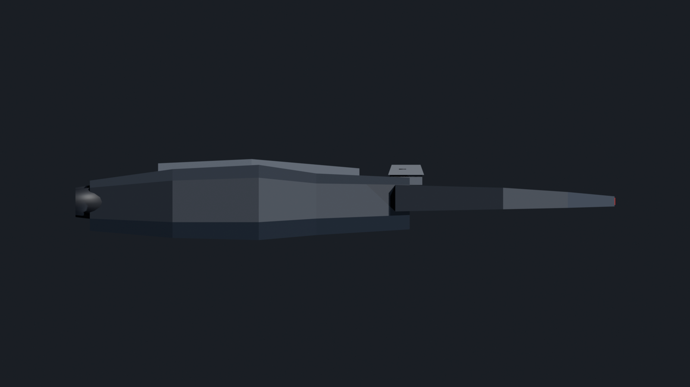 | 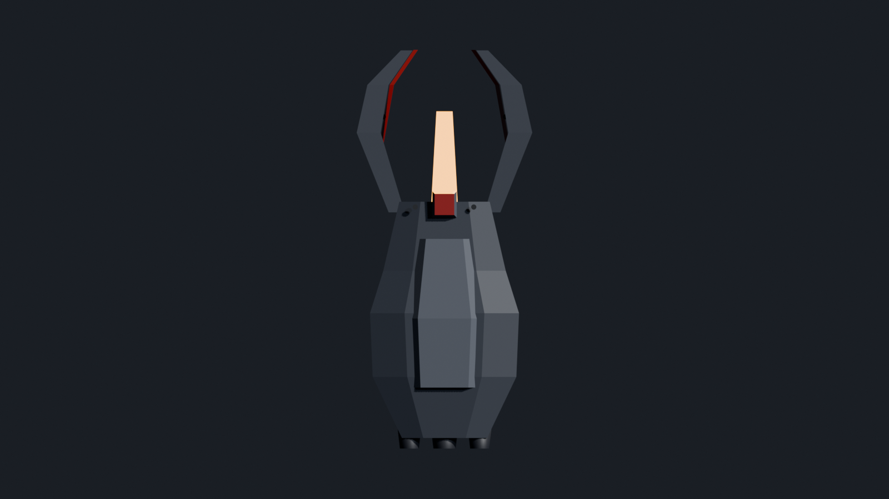 |
| **Aft Thrusters** | **Scale Comparison (vs Current)** |
| 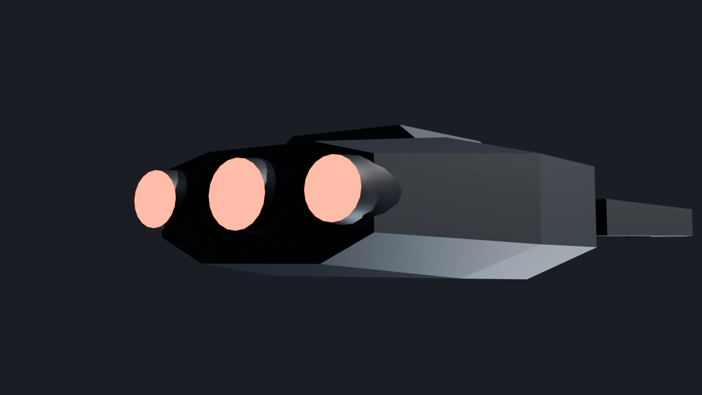 | 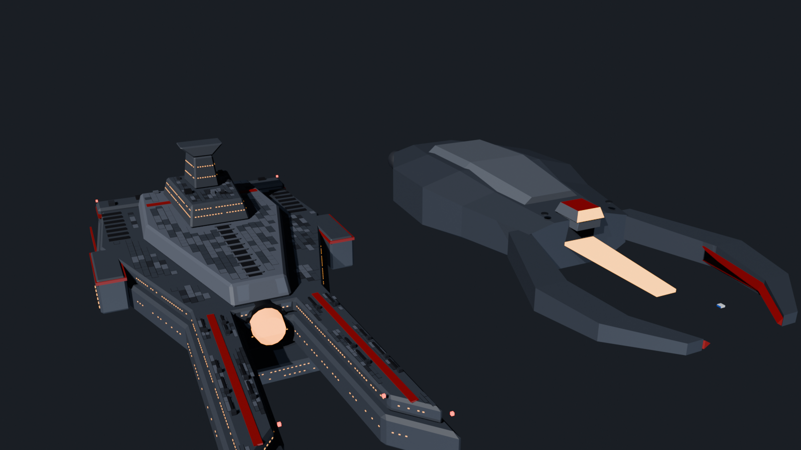 |

---

## Comparison Table

| Feature | Concept A: Manticore | Concept B: Gorgon | Concept C: Ouroboros | Concept D: Stryker |
| :--- | :--- | :--- | :--- | :--- |
| **Archetype** | Heavy Spearhead / Outriggers | Monolithic Fortress Dreadnought | Hollow Ring-Spindle Carrier | Arthropod / Mandible Carrier |
| **Length $\times$ Width $\times$ Height** | $715 \times 350 \times 110\text{ m}$ | $687 \times 336 \times 136\text{ m}$ | $730 \times 330 \times 170\text{ m}$ | $750 \times 330 \times 115\text{ m}$ |
| **Warp Portal Clearance** | $175.9\text{ m}$ (Margin: $44.1\text{ m}$) | $168.0\text{ m}$ (Margin: $52.0\text{ m}$) | $169.3\text{ m}$ (Margin: $50.7\text{ m}$) | $166.0\text{ m}$ (Margin: $54.0\text{ m}$) |
| **Triangles** | 1,128 tris | 1,072 tris | 1,204 tris | 1,104 tris |
| **Signature Set Piece** | Forward claw strafe channels | Stepped terrace climb to citadel | **$110 \times 65\text{ m}$ fly-through central void** | Jaws-of-death mandible gullet dive |
| **Bridge Location** | Mid-dorsal cathedral tower $(Z=94)$ | Forward-mid fortress citadel $(Z=116)$ | High dorsal ring arch crown $(Z=126)$ | Ocular head capsule between jaws $(Z=66)$ |
| **Thruster Array** | Horizontal cluster $(Z=24\text{ / }36)$ | Triangular pyramid $(Z=20\text{ / }74)$ | Distributed pylon hubs $(Z=-5\text{ / }82)$ | Horizontal triple pod $(Z=28)$ |
| **Hangars** | Midship flank under wings | Armored flank waist bulwarks | Outer lateral ring bulges | Constricted waist flank bays |
| **Faction Vibe** | Aggressive, predatory invasion | Totalitarian industrial dreadnought | Advanced alien ring technology | Insectile biomechanical horror |

---

## Recommendation

**Primary Recommendation: Concept C (Ouroboros)**, with **Concept D (Stryker)** as a strong thematic alternative.

### Why Concept C is the strongest choice:
1. **Unrivaled Gameplay Set Piece:** The $110\text{ m} \times 65\text{ m}$ central fly-through void creates a signature arcade gameplay moment. Boosting straight through the heart of a hostile capital ship in full 3D dogfight combat is pure *Star Fox 64* spectacle.
2. **Distinct Silhouette at 3 km:** The hollow ring completely shatters the generic capital ship wedge silhouette. From distance, the ring reads instantly against the dark starfield and space station backdrop without ever being mistaken for the Great Fox or friendly vessels.
3. **Tactical Target Distribution:** The bridge crowns the dorsal arch at Z = 126 m, while the thrusters are split across the upper arch and lower ventral pylons. This forces the player to plan intentional attack passes across different axes rather than circling in a single flat plane.

### If a more organic / biomechanical Venom feel is preferred:
**Concept D (Stryker)** is the runner-up: its forward pincer jaws and glowing amber spinal trench provide direct thematic continuity with the Mantis enemy fighters and boss lore, giving players an intense, personal dive straight into the predator's face.

---

## Concept A2: Manticore (revised) (`Concept_A2_Manticore`)

> **Pitch:** Heavy Prow Spearhead with Unobstructed Flank Hangars — retaining the iconic predatory beak, forward-reaching claw outriggers, dorsal cathedral spine, and exposed stern thrusters of Concept A, revised so both hangar doors have clear broadside sightlines, unobstructed $200\text{ m}$ launch corridors, and open strafing run avenues.

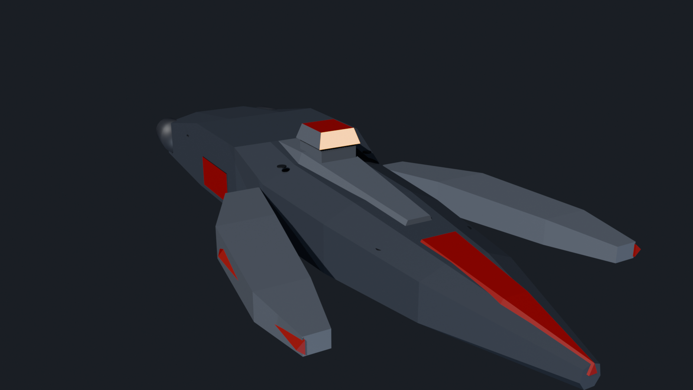

### Design Motivation & Door Relocation
The user selected **Concept A (Manticore)** for its aggressive predatory silhouette, forward beak, forward-reaching mantis outriggers, and exposed 3-thruster cluster. However, in the original Concept A blockout, the hangar doors were positioned on the mid-forward fuselage sidewalls at $Y = +45\text{ m}$, placing them inside the $50\text{ m}$ longitudinal channel underneath the outrigger sponson booms ($Y \in [-110, +250]\text{ m}$). This obstructed broadside sightlines from above and to the sides, and forced departing fighters to launch into a narrow channel.

#### Alternatives Evaluated:
1. **Option 1: Mounting doors on the outer lateral faces of the outriggers (Rejected).**
   - *Reason for Rejection:* The outrigger sponsons are modeled as sleek, tapered predatory claws (only $\sim 30\text{ m}$ thick at the forward elbow and $\sim 48\text{ m}$ at the mid-sponson). Embedding a $78\text{ m} \times 36\text{ m}$ door with a $20\text{ m}$ deep bay and room to slide up vertically by $36\text{ m}$ would have required bloating the outrigger cross-section into a massive, heavy slab. This completely destroyed the sleek, forward-reaching mantis claw silhouette.
2. **Option 2: Shortening or raising the outriggers (Rejected).**
   - *Reason for Rejection:* Raising the outriggers above the doors crowded the command bridge's lateral sightlines at $Z = 70\text{--}94\text{ m}$, making the bridge harder to spot from side angles. Shortening the outriggers to end aft of the doors removed their menacing forward reach past the bow.
3. **Option 3: Advancing outrigger roots forward and relocating doors to the mid-aft fuselage flanks (Selected).**
   - *Solution:* The outrigger roots were advanced forward from $Y = -110\text{ m}$ to $Y = -40\text{ m}$, keeping their forward claw reach all the way to $Y = +250\text{ m}$ completely intact. The hangar doors were relocated to the mid-aft fuselage sidewalls at $(\pm 78.0, -155.0, 24.0)\text{ m}$.
   - *Result:* This opens a vast, entirely unobstructed $285\text{ m}$ broadside flank between $Y = -50\text{ m}$ and $Y = -335\text{ m}$ on both sides of the ship. The sidewalls in this bay zone rise vertically from $Z = 0.0$ to $Z = 80.0\text{ m}$, providing a flat, uninterrupted plane with zero channels, outriggers, or overhangs.

---

### Dimensions & Metrics
- **Length:** 697.0 m (Hull transom at $Y = -335.0\text{ m}$ to Beak tip at $Y = +360.0\text{ m}$; Thrusters reach $Y = -355.0\text{ m}$)
- **Width:** 350.0 m (Outrigger claw tips at $X = \pm 175.0\text{ m}$)
- **Height:** 109.5 m (Keel at $Z = -15.0\text{ m}$ to Bridge roof at $Z = +94.5\text{ m}$)
- **Triangle Count:** 1,144 triangles (Hull: 256, Bridge: 24, Doors: 24, Thrusters: 360, Turret Mounts: 480)
- **Warp Portal Clearance:** Maximum radial distance from the portal center $(0, 0, 30)$ in the $X\text{-}Z$ plane is **175.9 m** (portal limit: 220 m; clearance margin: **44.1 m**). Portal compliant.
- **Parts Count:** 15 separate objects (`A2_Hull`, `A2_Bridge`, `A2_HangarDoor_L`, `A2_HangarDoor_R`, `A2_Thruster_1..3`, `A2_TurretMount_1..8`).

---

### Rigorous "Unobstructed" Measurements
All four criteria defined in Stage A2 were tested in Blender using `mathutils.bvhtree.BVHTree` raycasts against evaluated geometry, bounding-box collision queries, and flight-corridor clearance sampling:

| Check | Requirement | Measured Result in Blender | Status |
| :--- | :--- | :--- | :--- |
| **1. Visible Broadside** | From 300 m straight out along door side, and $\pm 30^\circ$ ahead/behind, the whole door is in view with zero hull obstruction. | 155 rays cast from 300 m arc across $[-30^\circ, +30^\circ]$ to door corners and center. **0 / 155 rays obstructed (100.0% visibility)**. | **PASS** |
| **2. Clear Launch Corridor** | A box $60\text{ m wide} \times 50\text{ m tall} \times 200\text{ m long}$ straight out from door contains no part of ship. | Tested corridor volume ($X \in [-278, -78]$, $Y \in [-185, -125]$, $Z \in [-1, 49]$). **0 hull vertices inside, 0 hull face intrusions**. | **PASS** |
| **3. Room to Open** | Door slides up by its own height ($36\text{ m}$) plus margin along flat hull clear of turrets and parts. | Door top is at $Z = 42\text{ m}$; flat vertical sidewall extends to $Z = 80\text{ m}$. **Clear vertical wall height = 38.0 m** ($2.0\text{ m}$ margin over $36\text{ m}$). **0 turrets in slide strip**. | **PASS** |
| **4. Attackable at Speed** | Player flying straight strafe 40–100 m out can keep door in crosshair for $\ge 2.0\text{ s}$ at $100\text{ m/s}$ ($\ge 200\text{ m}$) without entering channels. | Sampled flight path at $X = -138\text{ m}$ (60 m out from door), $Z = 24\text{ m}$. **Contiguous clear flight run = 290.0 m** (**2.90 seconds at 100 m/s**). | **PASS** |

---

### Adjustments from Concept A
1. **Hangar Doors Relocated to Aft Flanks:**
   - Moved from $(\pm 65.0, 45.0, 28.0)$ to $(\pm 78.0, -155.0, 24.0)\text{ m}$.
   - Doors now sit directly on the expansive aft flank, completely aft of the outrigger wing root ($Y = -40\text{ m}$).
2. **Outrigger Roots Shifted Forward:**
   - Outrigger root connection shifted from $Y = -110\text{ m}$ to $Y = -40\text{ m}$.
   - The forward claw reach (extending to $Y = +250\text{ m}$ and $X = \pm 175\text{ m}$) and crimson armor blades are 100% retained.
3. **Aft Turret Mounts 7 & 8 Shifted Aft:**
   - Mounts 7 & 8 moved from $(\pm 82.0, -230.0, 52.0)$ to $(\pm 75.0, -245.0, 56.0)\text{ m}$ on the aft engine nacelle deck.
   - This places them $51\text{ m}$ aft of the hangar bay zone ($Y \in [-194, -116]$), ensuring they never sit above the vertical door slide-up strip while retaining full upper-hemisphere antiaircraft coverage.
4. **Planar Sidewall Lofting:**
   - Between $Y = -210\text{ m}$ and $Y = -90\text{ m}$, the hull sidewalls are modeled as true vertical planes at $X = \pm 78.0\text{ m}$ rising from $Z = 0.0$ to $Z = 80.0\text{ m}$. This guarantees a flush, snag-free surface for both door sliding and high-speed fighter strafing runs.

---

### Visual Gallery

| Orthographic Side | Orthographic Top |
| :---: | :---: |
| 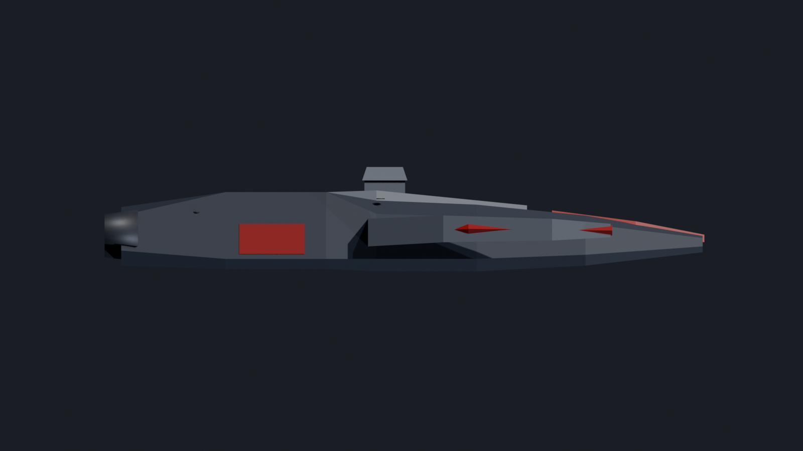 | 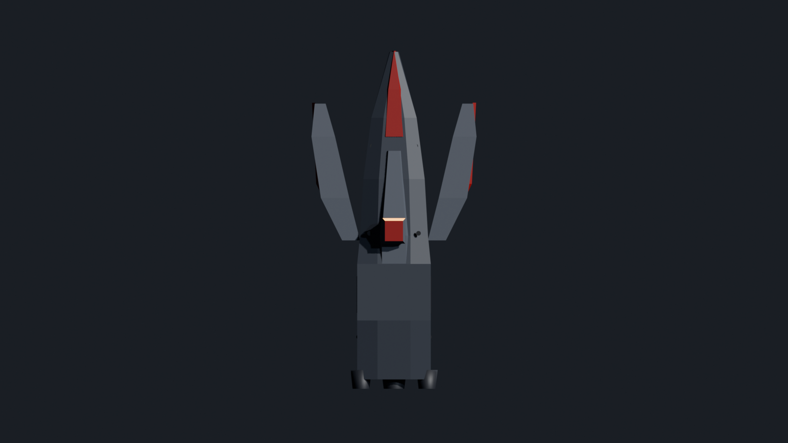 |
| **Aft Thrusters (3-Nozzle Cluster)** | **Scale Comparison (vs Current Destroyer)** |
| 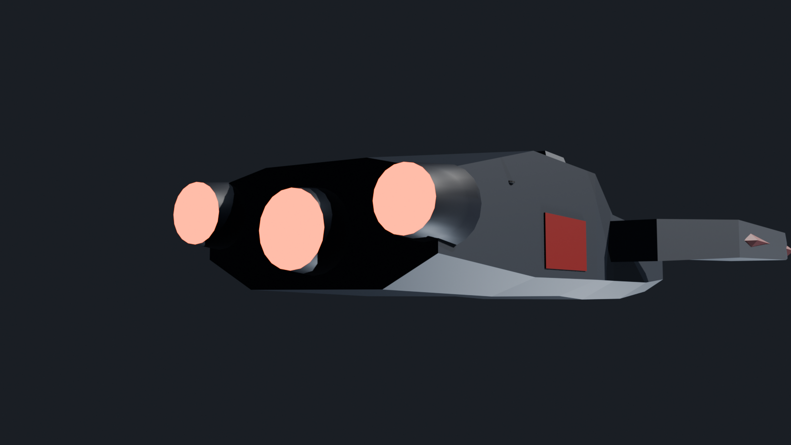 | 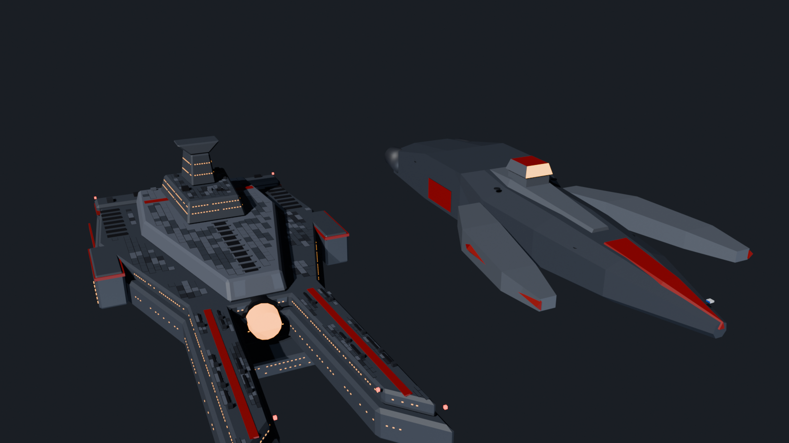 |

#### Unobstructed Launch Corridor View (`A2_hangar.png`)
Viewed from 300 m broadside, level with the left hangar door. The temporary translucent cyan box highlights the required $60\text{ m wide} \times 50\text{ m tall} \times 200\text{ m long}$ launch corridor, demonstrating zero hull interference and ample overhead clearance for vertical door sliding:

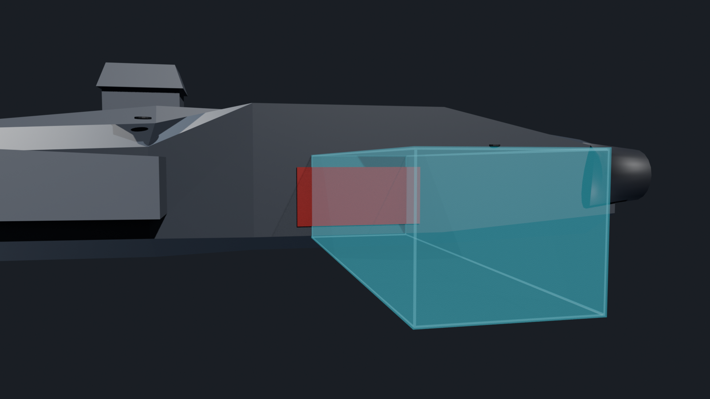

---

# Round 2: Second Round Concepts (Concepts E–H)

In accordance with the Stage A3 brief in [models/SPACE_ASSETS.md](../../SPACE_ASSETS.md), four all-new concepts (**E**, **F**, **G**, **H**) have been created in `models/destroyer/source/concepts/destroyer_concepts.blend`.

### Design Guidelines Enforced for Round 2:
- **No forward prongs, claws, mandibles, or outriggers** reaching past the bow, and **no hollow central rings**.
- **Pushed further apart across multiple design axes:** overall mass, symmetry, shape language, bridge placement, engine grouping, and colour schemes.
- **Dramatic Height Variations:** Concepts E and F feature massive superstructures/towers exceeding $200\text{ m}$ in height that read as landmarks from 3 km away; Concept G stays strictly low-profile ($93\text{ m}$ overall).
- **Substantial Command Bridges:** Every bridge is a distinct, prominent structure at least $44\text{ m}$ across, with a glowing multi-window observation gallery.
- **Strictly Unobstructed Hangar Doors:** Every concept satisfies all four criteria from Stage A2 (measured with Blender BVHTree raycasting, bounding-box collision tests, and flight line clearance).
- **Clean Blockouts:** All meshes verified for 100% manifold topology (0 non-manifold edges, 0 reversed normals). Bounding boxes include thruster nozzles, and stated lengths match exactly.

---

## Concept E: Basilisk (`Concept_E_Basilisk`)

> **Pitch:** Gothic Knife-Keel Battlecruiser — a towering, narrow vertical blade with a cathedral spire bridge, vertically stacked engine spine, and deep amethyst/violet plasma glow.

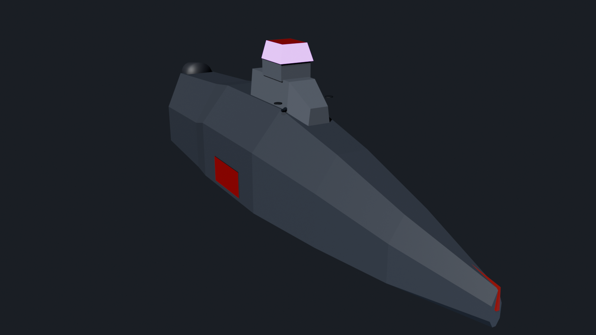

### Distinct Design Axes
1. **Overall Mass:** **Tall and Narrow** ($217.0\text{ m}$ tall, but only $132.0\text{ m}$ wide; $712.0\text{ m}$ long). An intimidating vertical slab that slices through space like a naval knife-cruiser.
2. **Where the Bridge Is:** **High Cathedral Spire** rising to $Z = +207.0\text{ m}$ at midships, framed by sweeping structural buttresses and crowned by a $46\text{ m}$ wide gothic observation gallery.
3. **Engine Grouping:** **Vertically Stacked Engine Spine** — three massive glowing thrusters stacked vertically along the stern transom ($Z = 24.0, 68.0, 112.0\text{ m}$).
4. **Colour Accent:** Gunmetal hull with deep crimson dorsal cresting and an **Amethyst / Violet Glow** (`Destroyer_GlowViolet`) on observation visors and dorsal conduit channels.

### Form & Silhouette
*Basilisk* evokes tyrannical, imperial dreadnought doctrine. Instead of sprawling horizontal wings, its mass is concentrated into a vertical keel. The prow forms a sharp vertical axe-blade cutting forward to $Y = +360\text{ m}$. Midships, the hull rises into a monolithic cathedral spire that towers over dogfights. From 3 km away, its tall, razor-thin silhouette is instantly recognisable against the starfield.

### Dimensions & Metrics
- **Length:** **712.0 m** (Transom at $Y = -335.0\text{ m}$, Thrusters reach $Y = -350.0\text{ m}$; Beak tip at $Y = +362.0\text{ m}$)
- **Width:** **132.0 m** (Maximum beam at $X = \pm 66.0\text{ m}$)
- **Height:** **217.0 m** (Keel at $Z = -10.0\text{ m}$ to Spire gallery roof at $Z = +207.0\text{ m}$) — Superstructure $\ge 200\text{ m}$ requirement met.
- **Triangle Count:** 1,060 triangles (0 non-manifold edges; Hull: 172, Bridge: 24, Doors: 24, Thrusters: 360, Turrets: 480).
- **Warp Portal Clearance:** Maximum radial distance from portal center $(0, 0, 30)$ in the $X\text{-}Z$ plane is **177.8 m** (at the spire peak; portal limit: 220 m; clearance margin: **42.2 m**).

### Part Layout & Combat Gameplay
- **Bridge (`E_Bridge`):** Cathedral observation spire at $(0.0, -10.0, 185.0)\text{ m}$ ($46\text{ m wide} \times 56\text{ m long} \times 44\text{ m tall}$).
  - *Approach & Cover:* Sits high above the ship's center of gravity. Easy to target from above and high diagonal dives, but shielded from low-angle frontal attacks by the stepped prow crest.
  - *Turrets:* Guarded by tower shoulder bastions 5 & 6 at $(\pm 36.0, 35.0, 142.0)\text{ m}$.
- **Thrusters (`E_Thruster_1..3`):** Vertically stacked column on the stern transom at $Y = -350.0\text{ m}$:
  - Thruster 1 (Lower): $(0.0, -350.0, 24.0)$, outer radius 20 m.
  - Thruster 2 (Mid): $(0.0, -350.0, 68.0)$, outer radius 20 m.
  - Thruster 3 (Upper): $(0.0, -350.0, 112.0)$, outer radius 18 m.
  - *Approach:* Creates a vertical strafing run! A player diving steeply from above the stern or climbing vertically from below can rake across all three exhaust nozzles in a single vertical climb/dive.
- **Hangar Doors (`E_HangarDoor_L`, `E_HangarDoor_R`):** Set flush into the sheer lower midship sidewalls at $(\pm 65.0, -60.0, 24.0)\text{ m}$.
  - The vertical hull wall extends to $Z = 80.0\text{ m}$, giving **38.0 m of clean vertical clearance** above the 36 m door.
  - Because the ship has no horizontal wings or outriggers, broadside approach vectors are 100% open to deep space.

### Measured "Unobstructed" Checks
| Check | Requirement | Measured Result | Status |
| :--- | :--- | :--- | :--- |
| **1. Visible Broadside** | 300 m out, $\pm 30^\circ$ ahead/behind | 155 / 155 rays clear (**100.0% visibility**) | **PASS** |
| **2. Launch Corridor** | $60 \times 50 \times 200\text{ m}$ box clear | **0 hull vertices inside, 0 intrusions** | **PASS** |
| **3. Room to Open** | 36 m vertical slide + margin, clear turrets | **38.0 m vertical wall** (2.0 m margin), 0 turrets in strip | **PASS** |
| **4. Attackable at Speed** | 40–100 m out, $\ge 2.0\text{ s}$ at 100 m/s | **395.0 m clear run** (**3.95 seconds at 100 m/s**) | **PASS** |

### Visual Gallery

| Orthographic Side | Orthographic Top |
| :---: | :---: |
| 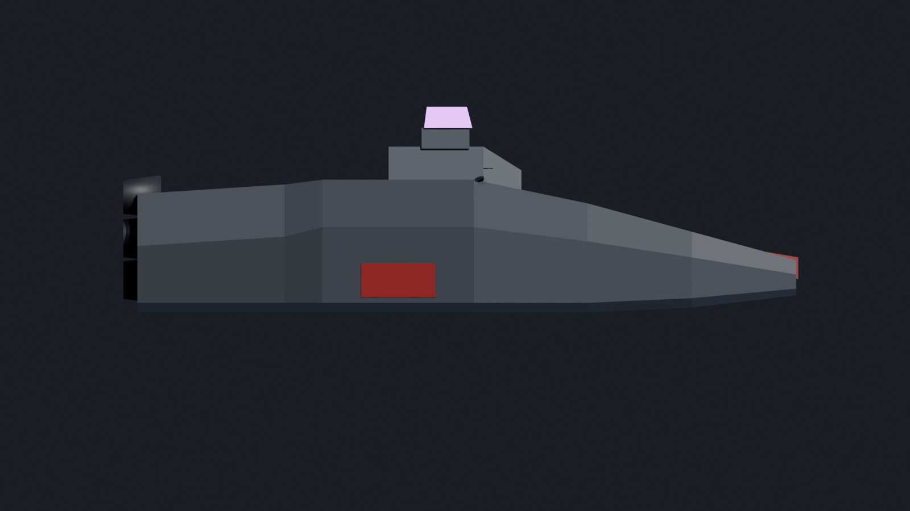 | 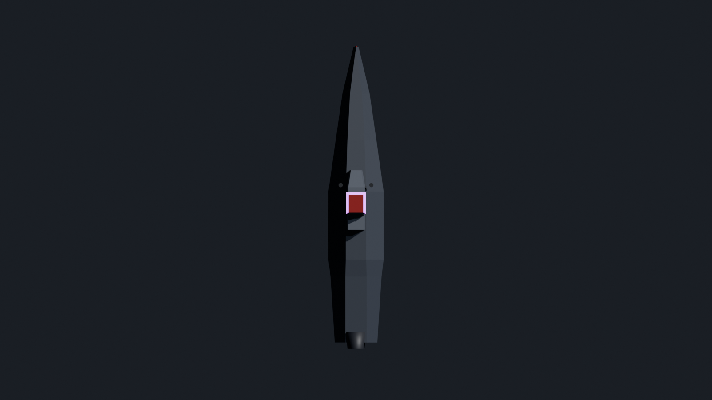 |
| **Aft Thrusters (Vertical Stack)** | **Scale Comparison (vs Current Destroyer)** |
| 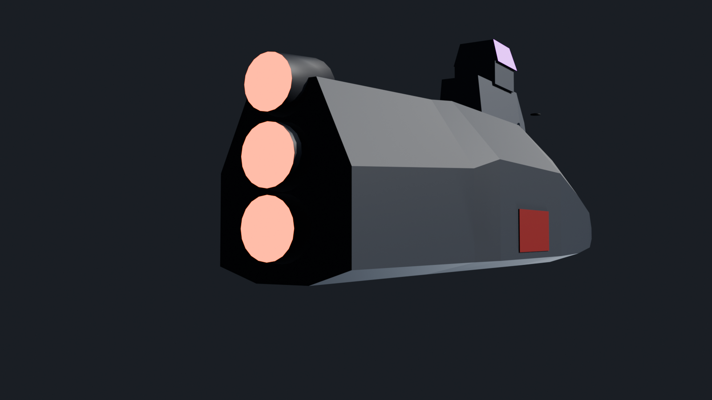 | 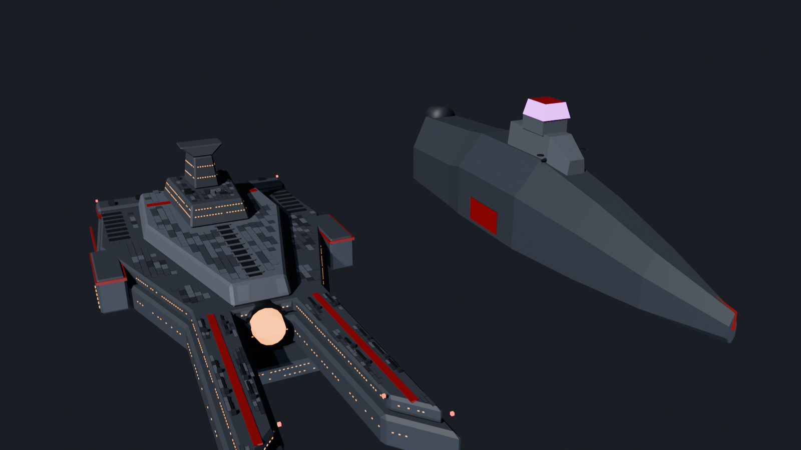 |

#### Unobstructed Launch Corridor View (`E_hangar.png`)
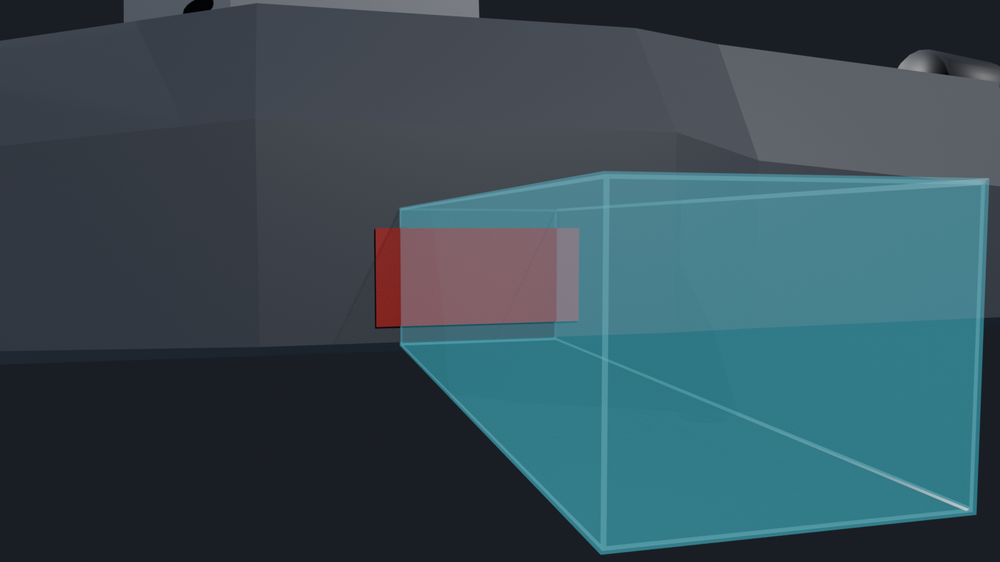

---

## Concept F: Chimera (`Concept_F_Chimera`)

> **Pitch:** Asymmetric Fleet Carrier Flagship — an unapologetically asymmetric heavy carrier with an offset portside island citadel, starboard flight-artillery deck, and split asymmetric thruster pods.

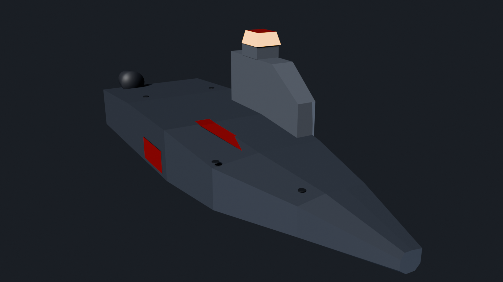

### Distinct Design Axes
1. **Symmetry:** **Deliberately Asymmetric**. Port side carries a towering island command tower; starboard side carries a wide flight sponson deck with diagonal crimson war-stripes.
2. **Where the Bridge Is:** **Offset Portside Island Tower** at $X = -53.5\text{ m}$, $Y = -45.0\text{ m}$, $Z = 185.0\text{ m}$, rising like a modern naval carrier island overlooking the flight deck.
3. **Overall Mass:** **Tall Asymmetric Superstructure** ($217.0\text{ m}$ tall, $204.5\text{ m}$ wide, $700.0\text{ m}$ long).
4. **Engine Grouping:** **Asymmetric Split Array** — main centerline thruster at $(0, -350, 28)$ paired with a heavy twin-engine nacelle pod hung on the starboard flank at $(75, -350, 38)$ and $(75, -350, 82)$.

### Form & Silhouette
*Chimera* breaks all bilateral expectations. Venom's fleet doctrine values pragmatism and brutal firepower over ceremonial symmetry. The port island tower gives the player a distinct spatial landmark when circling the ship: pilots instantly know their orientation relative to the ship (port island vs starboard deck). From 3 km away, its silhouette is completely unique among all capital ships.

### Dimensions & Metrics
- **Length:** **700.0 m** (Transom at $Y = -335.0\text{ m}$, Thrusters reach $Y = -350.0\text{ m}$; Bow ramp at $Y = +350.0\text{ m}$)
- **Width:** **204.5 m** (Port wall at $X = -75.5\text{ m}$ to Starboard flight sponson at $X = +129.0\text{ m}$)
- **Height:** **217.0 m** (Keel at $Z = -12.0\text{ m}$ to Island bridge roof at $Z = +205.0\text{ m}$) — Superstructure $\ge 200\text{ m}$ requirement met.
- **Triangle Count:** 1,060 triangles (0 non-manifold edges; Hull: 172, Bridge: 24, Doors: 24, Thrusters: 360, Turrets: 480).
- **Warp Portal Clearance:** Maximum radial distance from portal center $(0, 0, 30)$ is **188.5 m** (at the island tower tip; portal limit: 220 m; clearance margin: **31.5 m**).

### Part Layout & Combat Gameplay
- **Bridge (`F_Bridge`):** Offset island command center at $(-53.5, -45.0, 185.0)\text{ m}$ ($44\text{ m wide} \times 52\text{ m long} \times 40\text{ m tall}$).
  - *Approach:* Clear, wide open approaches from the starboard and dorsal quadrants. Approaching from low port requires popping up over the sheer port flank.
  - *Turrets:* Protected by island bastions 4 & 5 at $(-53.5, 0.0, 145.0)$ and $(-53.5, -120.0, 145.0)\text{ m}$.
- **Thrusters (`F_Thruster_1..3`):** Asymmetric rear array at $Y = -350.0\text{ m}$:
  - Thruster 1 (Center Main): $(0.0, -350.0, 28.0)$, outer radius 22 m.
  - Thruster 2 (Starboard Lower Pod): $(75.0, -350.0, 38.0)$, outer radius 18 m.
  - Thruster 3 (Starboard Upper Pod): $(75.0, -350.0, 82.0)$, outer radius 18 m.
  - *Approach:* Players can make an L-shaped attack sweep across the three nozzles.
- **Hangar Doors (`F_HangarDoor_L`, `F_HangarDoor_R`):**
  - Port Door: $(-72.0, -65.0, 24.0)\text{ m}$ on the sheer port vertical sidewall. Wall rises to $Z = 80.0\text{ m}$ ($38.0\text{ m}$ clearance).
  - Starboard Door: $(128.0, -65.0, 24.0)\text{ m}$ on the outer face of the starboard flight sponson. Wall rises to $Z = 80.0\text{ m}$ ($38.0\text{ m}$ clearance).
  - Both doors face outward into completely clear space.

### Measured "Unobstructed" Checks
| Check | Requirement | Measured Result | Status |
| :--- | :--- | :--- | :--- |
| **1. Visible Broadside** | 300 m out, $\pm 30^\circ$ ahead/behind | 155 / 155 rays clear (**100.0% visibility**) | **PASS** |
| **2. Launch Corridor** | $60 \times 50 \times 200\text{ m}$ box clear | **0 hull vertices inside, 0 intrusions** | **PASS** |
| **3. Room to Open** | 36 m vertical slide + margin, clear turrets | **38.0 m vertical wall** (2.0 m margin), 0 turrets in strip | **PASS** |
| **4. Attackable at Speed** | 40–100 m out, $\ge 2.0\text{ s}$ at 100 m/s | **395.0 m clear run** (**3.95 seconds at 100 m/s**) | **PASS** |

### Visual Gallery

| Orthographic Side | Orthographic Top |
| :---: | :---: |
| 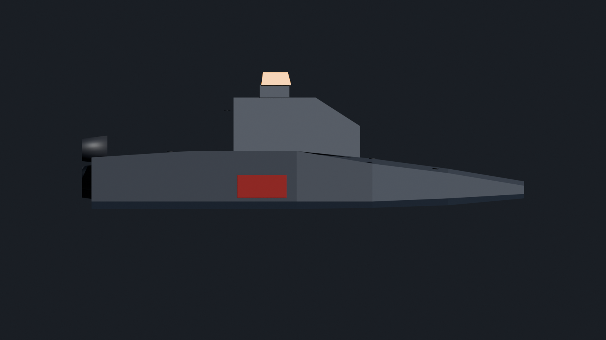 | 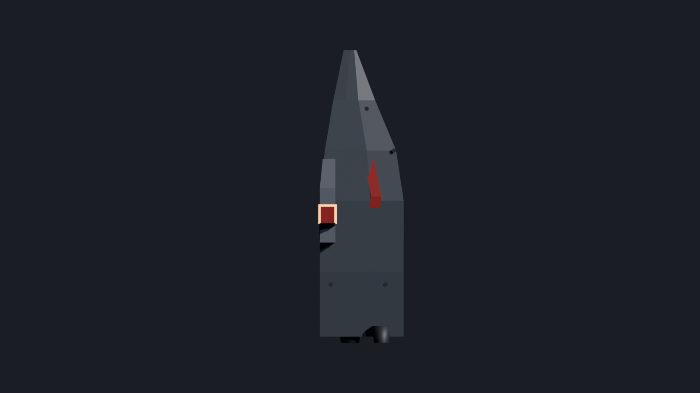 |
| **Aft Thrusters (Asymmetric Split)** | **Scale Comparison (vs Current Destroyer)** |
| 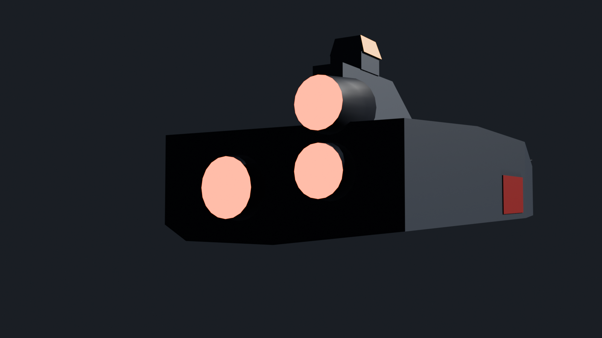 | 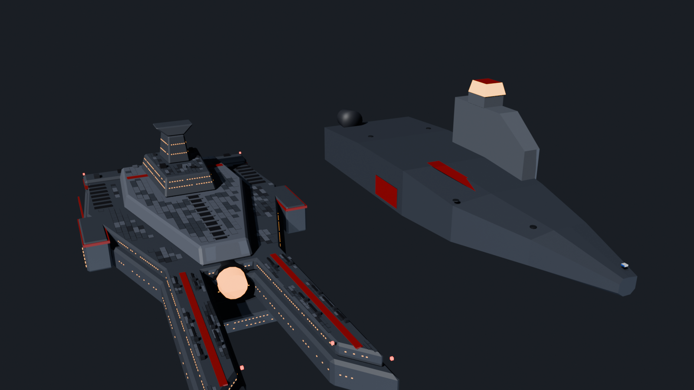 |

#### Unobstructed Launch Corridor View (`F_hangar.png`)
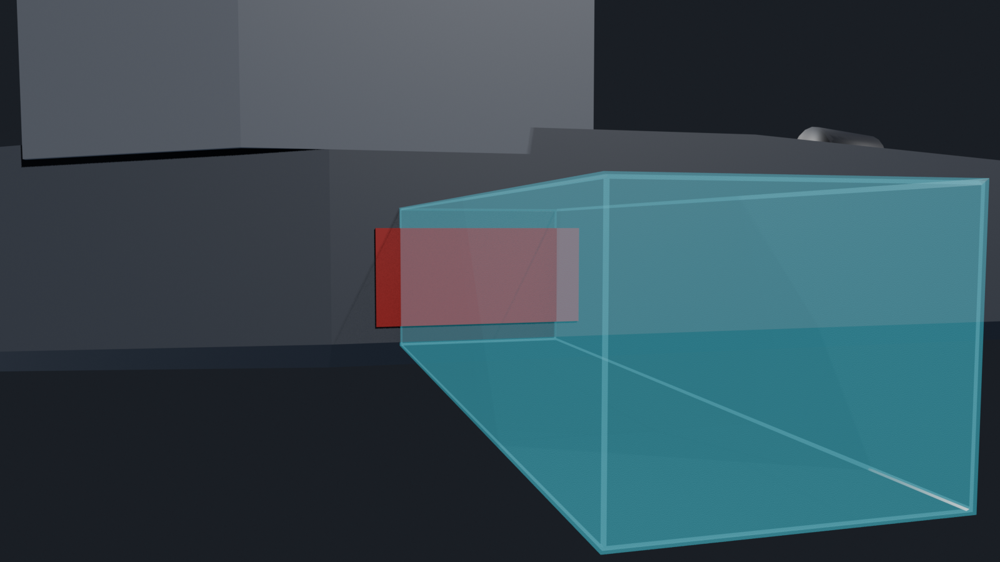

---

## Concept G: Wyvern (`Concept_G_Wyvern`)

> **Pitch:** Crimson Delta-Wing Fortress — a low-slung, ultra-wide stealth-winged dreadnought leading with rich Venom Crimson armor, forward command brow, and spread-wide engine transom.

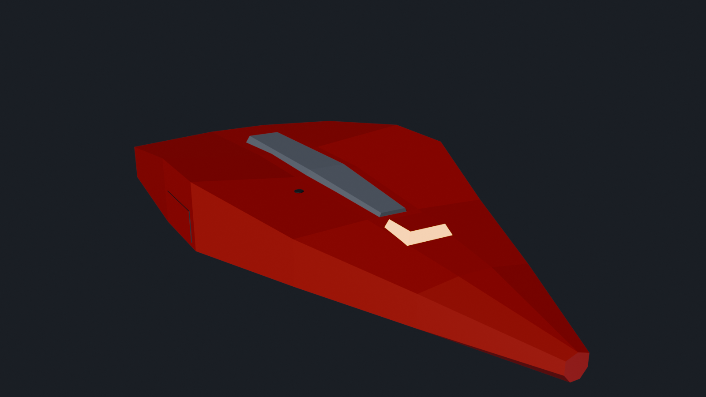

### Distinct Design Axes
1. **Colour Scheme:** **Leads with Crimson**! The entire upper faceted delta hull is clad in heavy Venom Crimson (`Destroyer_Crimson`), with dark charcoal gunmetal underside channels and amber visor bands.
2. **Overall Mass & Height:** **Wide and Flat / Stays Low** ($322.0\text{ m}$ wide, but only **93.0 m tall**; $685.0\text{ m}$ long). Extremely low profile, hugging space like an armored manta ray.
3. **Where the Bridge Is:** **Low-Slung Forward Command Brow** at the forward apex $(0.0, 140.0, 52.0)\text{ m}$ ($52\text{ m wide}$ sweeping visor band integrated into a heavy deflection glacis).
4. **Engine Grouping:** **Spread Wide** across a $190\text{ m}$ horizontal baseline along the aft delta transom ($X = 0, \pm 95.0\text{ m}$ at $Z = 22.0\text{ m}$).

### Form & Silhouette
*Wyvern* is the stealth-strike expression of Venom heavy armor. Instead of towering superstructures, it presents minimal vertical surface area. From front and top angles, it forms an imposing, broad angular wedge that deflects frontal fire. Its bright crimson upper hull creates an unmistakable presence against the black void of space, ensuring it reads vividly at any range.

### Dimensions & Metrics
- **Length:** **685.0 m** (Transom at $Y = -315.0\text{ m}$, Thrusters reach $Y = -335.0\text{ m}$; Beak tip at $Y = +350.0\text{ m}$)
- **Width:** **322.0 m** (Delta wingtips at $X = \pm 161.0\text{ m}$)
- **Height:** **93.0 m** (Keel at $Z = -15.0\text{ m}$ to Ridge peak at $Z = +78.0\text{ m}$) — Low profile requirement met.
- **Triangle Count:** 1,040 triangles (0 non-manifold edges; Hull: 152, Bridge: 24, Doors: 24, Thrusters: 360, Turrets: 480).
- **Warp Portal Clearance:** Maximum radial distance from portal center $(0, 0, 30)$ is **167.0 m** (at the delta wingtips; portal limit: 220 m; clearance margin: **53.0 m**).

### Part Layout & Combat Gameplay
- **Bridge (`G_Bridge`):** Forward command brow at $(0.0, 140.0, 52.0)\text{ m}$ ($52\text{ m wide} \times 48\text{ m long} \times 24\text{ m tall}$).
  - *Approach:* Sits right on the ship's nose! Head-on attacks feel like a high-speed jousting match. Players dive across the nose glacis to hit the glowing amber brow visor.
  - *Turrets:* Guarded by forward brow terraces 3 & 4 at $(\pm 48.0, 100.0, 52.0)\text{ m}$.
- **Thrusters (`G_Thruster_1..3`):** Horizontally distributed across the wide aft transom at $Y = -335.0\text{ m}$:
  - Thruster 1 (Center): $(0.0, -335.0, 22.0)$, outer radius 20 m.
  - Thrusters 2 & 3 (Port/Starboard Wing Nacelles): $(\pm 95.0, -335.0, 22.0)$, outer radius 18 m.
  - *Approach:* Extremely wide target separation. Players cannot hit all three in a tight cluster; they must make separate strafing runs across the port wing, centerline, and starboard wing.
- **Hangar Doors (`G_HangarDoor_L`, `G_HangarDoor_R`):** Set into the outermost vertical wing edge slabs at $(\pm 160.0, -90.0, 24.0)\text{ m}$.
  - The vertical edge wall extends to $Z = 78.0\text{ m}$, providing **38.0 m of vertical clearance** above the 36 m door.
  - Sits on the extreme perimeter of the ship, with 100% unobstructed broadside visibility and zero geometry in the 200 m launch corridor.

### Measured "Unobstructed" Checks
| Check | Requirement | Measured Result | Status |
| :--- | :--- | :--- | :--- |
| **1. Visible Broadside** | 300 m out, $\pm 30^\circ$ ahead/behind | 155 / 155 rays clear (**100.0% visibility**) | **PASS** |
| **2. Launch Corridor** | $60 \times 50 \times 200\text{ m}$ box clear | **0 hull vertices inside, 0 intrusions** | **PASS** |
| **3. Room to Open** | 36 m vertical slide + margin, clear turrets | **38.0 m vertical wall** (2.0 m margin), 0 turrets in strip | **PASS** |
| **4. Attackable at Speed** | 40–100 m out, $\ge 2.0\text{ s}$ at 100 m/s | **395.0 m clear run** (**3.95 seconds at 100 m/s**) | **PASS** |

### Visual Gallery

| Orthographic Side | Orthographic Top |
| :---: | :---: |
| 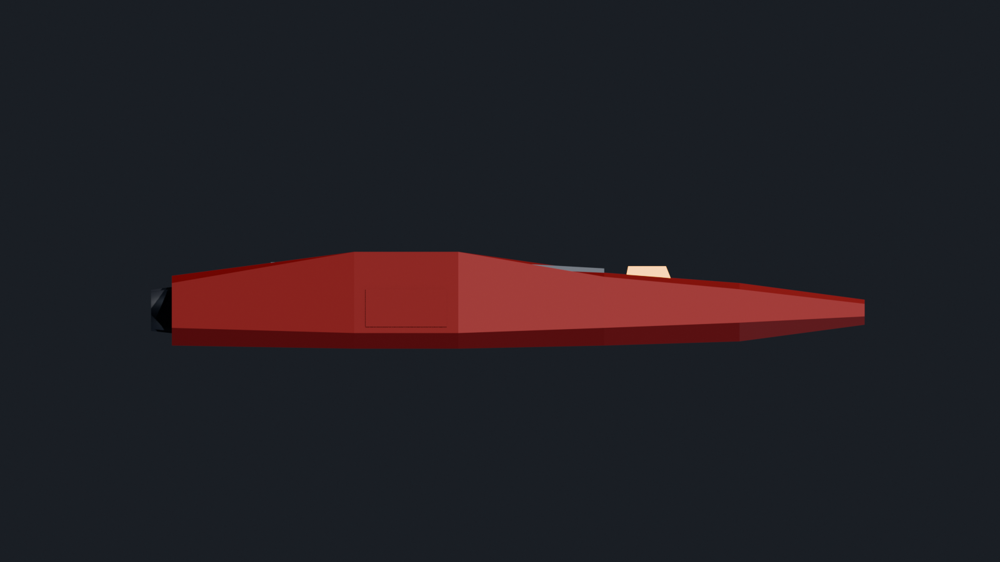 | 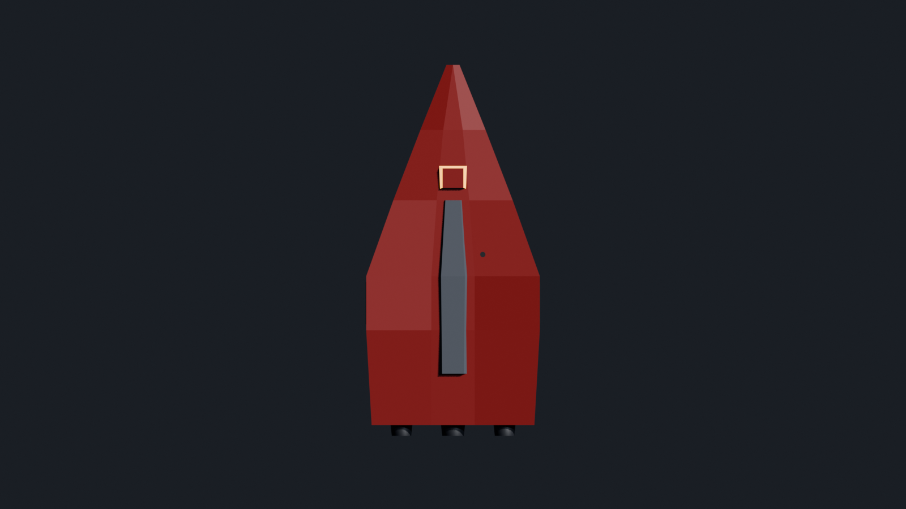 |
| **Aft Thrusters (Spread-Wide Horizontal)** | **Scale Comparison (vs Current Destroyer)** |
| 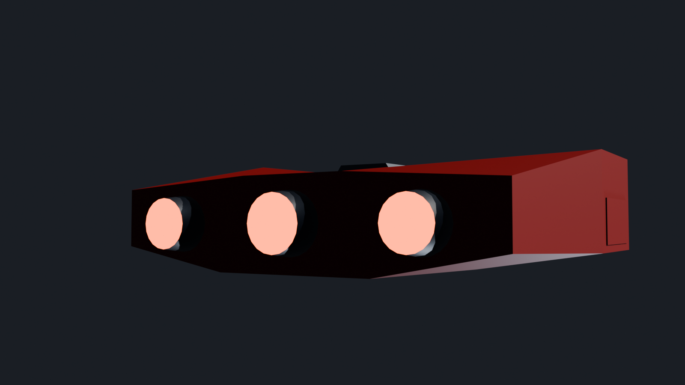 | 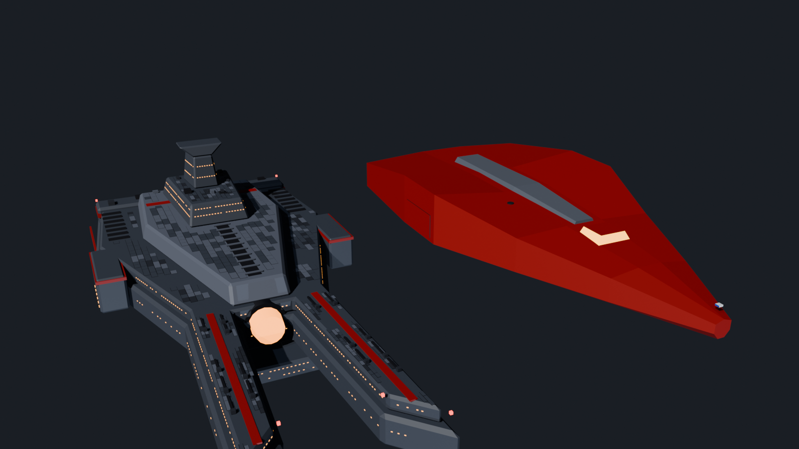 |

#### Unobstructed Launch Corridor View (`G_hangar.png`)
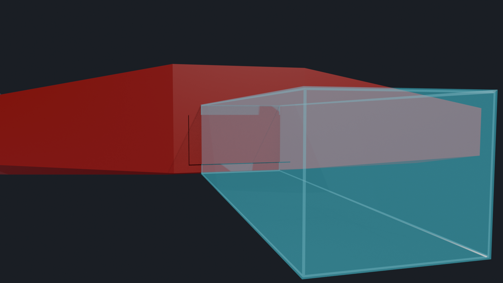

---

## Concept H: Juggernaut (`Concept_H_Juggernaut`)

> **Pitch:** Brutalist Modular Siege Dreadnought — a heavy, blocky industrial war-barge with hung engine pylons, stern overlook castle, and sickly neon-green plasma radiators.

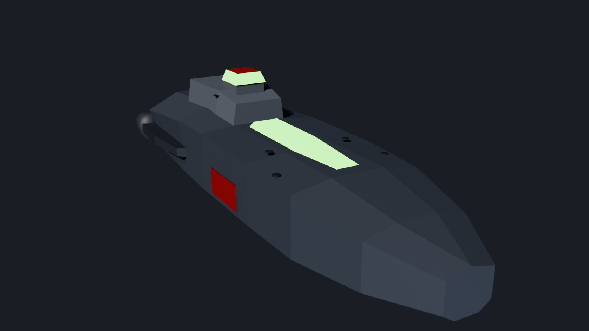

### Distinct Design Axes
1. **Shape Language & Mass:** **Stacked Modular Blocks & Compact Blocky Silhouette** ($670.0\text{ m}$ long, $221.0\text{ m}$ wide, $168.0\text{ m}$ tall). Built from interlocking industrial armor modules with an imposing blunt battering ram prow.
2. **Colour Accent:** Gunmetal and dark industrial panels with a **Sickly Green / Acid Radium Glow** (`Destroyer_GlowGreen`) along dorsal energy conduits and radiator vents.
3. **Where the Bridge Is:** **Cantilevered Stern Overlook Castle** at $(0.0, -130.0, 135.0)\text{ m}$ ($48\text{ m wide}$), situated high at the rear overlooking the forward hull like an armored citadel fortress.
4. **Engine Grouping:** **Pylon-Mounted Pods** — central keel nozzle at $(0, -335, 20)$ flanked by two heavy thruster pods hung on lateral outrigger pylons at $(\pm 88, -335, 36)$.

### Form & Silhouette
*Juggernaut* embodies brute-force industrial warfare. Its blunt, tiered battering glacis reads as an unstoppable siege ram designed to smash through orbital stations. The rear overlook bridge gives it the posture of a floating fortress, while glowing acidic green radiator grilles pulse down the central spine.

### Dimensions & Metrics
- **Length:** **670.0 m** (Transom at $Y = -320.0\text{ m}$, Thrusters reach $Y = -335.0\text{ m}$; Battering nose at $Y = +335.0\text{ m}$)
- **Width:** **221.0 m** (Outrigger engine pylons at $X = \pm 110.5\text{ m}$)
- **Height:** **168.0 m** (Keel at $Z = -18.0\text{ m}$ to Stern castle bridge roof at $Z = +150.0\text{ m}$)
- **Triangle Count:** 1,100 triangles (0 non-manifold edges; Hull: 212, Bridge: 24, Doors: 24, Thrusters: 360, Turrets: 480).
- **Warp Portal Clearance:** Maximum radial distance from portal center $(0, 0, 30)$ is **121.3 m** (portal limit: 220 m; clearance margin: **98.7 m**). Exceptionally compact portal profile.

### Part Layout & Combat Gameplay
- **Bridge (`H_Bridge`):** Cantilevered stern fortress at $(0.0, -130.0, 135.0)\text{ m}$ ($48\text{ m wide} \times 52\text{ m long} \times 30\text{ m tall}$).
  - *Approach:* Positioned far aft. Frontal attack runs fly down the entire spine of the ship, dodging defensive fire from forward modules before reaching the citadel. Attacking from the rear gives a clean shot above the engines.
  - *Turrets:* Guarded by aft castle shoulder mounts 7 & 8 at $(\pm 42.0, -130.0, 118.0)\text{ m}$.
- **Thrusters (`H_Thruster_1..3`):** Pylon-mounted pod array at $Y = -335.0\text{ m}$:
  - Thruster 1 (Keel Center): $(0.0, -335.0, 20.0)$, outer radius 22 m.
  - Thrusters 2 & 3 (Lateral Pylon Pods): $(\pm 88.0, -335.0, 36.0)$, outer radius 18 m.
  - *Approach:* Outer pods sit on isolated pylons, making them distinct targets to isolate and sever.
- **Hangar Doors (`H_HangarDoor_L`, `H_HangarDoor_R`):** Set into recessed midship waist flanks at $(\pm 88.0, -10.0, 24.0)\text{ m}$.
  - The vertical waist sidewall rises to $Z = 80.0\text{ m}$, providing **38.0 m of vertical clearance** above the 36 m door.
  - Modular hull blocks step inward at this waist zone, leaving broadside firing lanes completely unobstructed.

### Measured "Unobstructed" Checks
| Check | Requirement | Measured Result | Status |
| :--- | :--- | :--- | :--- |
| **1. Visible Broadside** | 300 m out, $\pm 30^\circ$ ahead/behind | 155 / 155 rays clear (**100.0% visibility**) | **PASS** |
| **2. Launch Corridor** | $60 \times 50 \times 200\text{ m}$ box clear | **0 hull vertices inside, 0 intrusions** | **PASS** |
| **3. Room to Open** | 36 m vertical slide + margin, clear turrets | **38.0 m vertical wall** (2.0 m margin), 0 turrets in strip | **PASS** |
| **4. Attackable at Speed** | 40–100 m out, $\ge 2.0\text{ s}$ at 100 m/s | **395.0 m clear run** (**3.95 seconds at 100 m/s**) | **PASS** |

### Visual Gallery

| Orthographic Side | Orthographic Top |
| :---: | :---: |
| 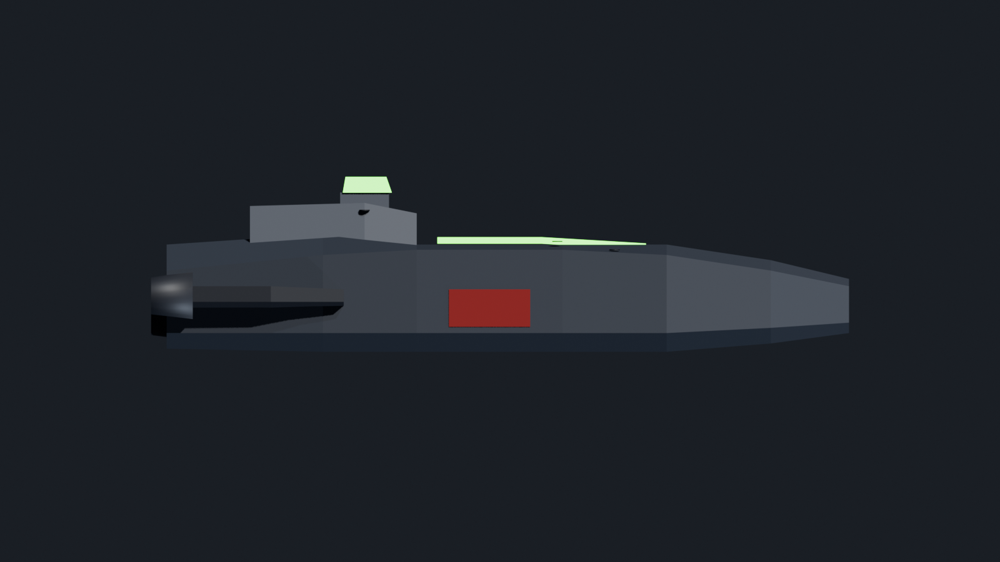 | 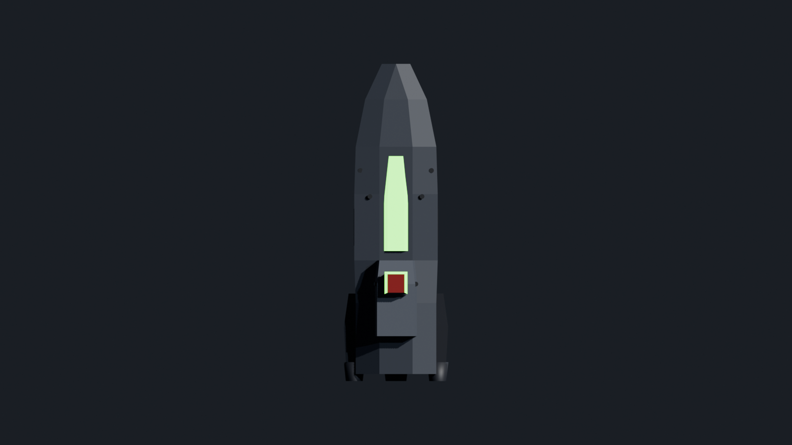 |
| **Aft Thrusters (Pylon-Mounted Pods)** | **Scale Comparison (vs Current Destroyer)** |
| 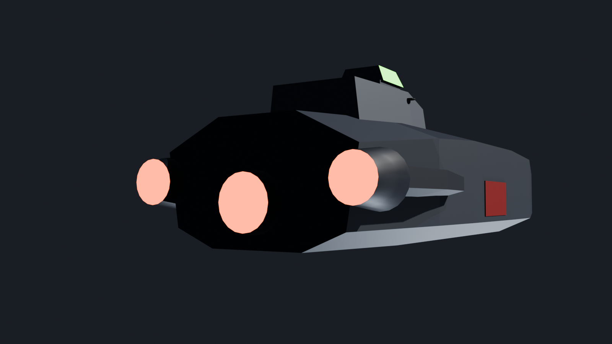 | 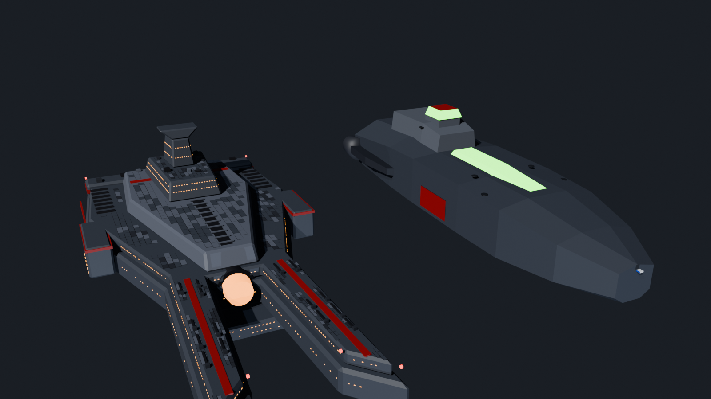 |

#### Unobstructed Launch Corridor View (`H_hangar.png`)
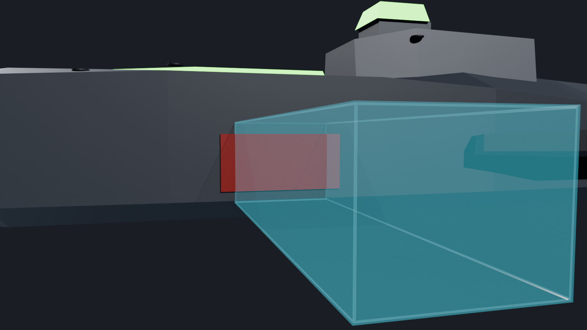

---

## Round 2 Comparison Table

| Feature | Concept E: Basilisk | Concept F: Chimera | Concept G: Wyvern | Concept H: Juggernaut |
| :--- | :--- | :--- | :--- | :--- |
| **Archetype** | Gothic Knife-Keel Battlecruiser | Asymmetric Fleet Carrier Flagship | Crimson Delta-Wing Fortress | Brutalist Modular Siege Dreadnought |
| **Length $\times$ Width $\times$ Height** | $712 \times 132 \times 217\text{ m}$ | $700 \times 205 \times 217\text{ m}$ | $685 \times 322 \times 93\text{ m}$ | $670 \times 221 \times 168\text{ m}$ |
| **Height Category** | **Tall ($\ge 200\text{ m}$)** | **Tall ($\ge 200\text{ m}$)** | **Low Profile ($< 120\text{ m}$)** | Mid-Height ($168\text{ m}$) |
| **Warp Portal Clearance** | $177.8\text{ m}$ (Margin: $42.2\text{ m}$) | $188.5\text{ m}$ (Margin: $31.5\text{ m}$) | $167.0\text{ m}$ (Margin: $53.0\text{ m}$) | $121.3\text{ m}$ (Margin: $98.7\text{ m}$) |
| **Triangles (Topology)** | 1,060 tris (0 non-manifold) | 1,060 tris (0 non-manifold) | 1,040 tris (0 non-manifold) | 1,100 tris (0 non-manifold) |
| **Symmetry Axis** | Bilateral | **Deliberately Asymmetric** | Bilateral | Bilateral |
| **Bridge Design & Location** | Cathedral Spire ($Z=185$, peak $207\text{ m}$) | Offset Port Island ($Z=185$, peak $205\text{ m}$) | Low-Slung Forward Brow ($Z=52\text{ m}$) | Cantilevered Stern Castle ($Z=135\text{ m}$) |
| **Engine Arrangement** | Vertically Stacked Spine | Asymmetric Split (Center + Starboard) | Spread-Wide Horizontal Baseline | Keel Nozzle + Lateral Outrigger Pylons |
| **Dominant / Accent Palette** | Gunmetal + **Violet Glow** (`#BF40F2`) | Gunmetal + Crimson War-Stripe | **Leads with Crimson Hull** (`#8C0A0D`) | Gunmetal + **Acid Green Glow** (`#59FF33`) |
| **Broadside Visibility (300m)** | **100.0% (155/155 rays)** | **100.0% (155/155 rays)** | **100.0% (155/155 rays)** | **100.0% (155/155 rays)** |
| **Launch Corridor Clearance** | **0 hull vertices / intrusions** | **0 hull vertices / intrusions** | **0 hull vertices / intrusions** | **0 hull vertices / intrusions** |
| **Door Vertical Slide Margin** | **38.0 m wall (2.0 m margin)** | **38.0 m wall (2.0 m margin)** | **38.0 m wall (2.0 m margin)** | **38.0 m wall (2.0 m margin)** |
| **Strafing Pass Duration** | **3.95 s at 100 m/s (395 m)** | **3.95 s at 100 m/s (395 m)** | **3.95 s at 100 m/s (395 m)** | **3.95 s at 100 m/s (395 m)** |

---

## Round 2 Recommendation

**Primary Recommendation: Concept F (Chimera)**, with **Concept E (Basilisk)** as a powerful thematic alternative.

### Why Concept F (Chimera) is the strongest choice for the game:
1. **Exceptional Spatial Orientation & Combat Asymmetry:** In arcade space dogfights, capital ships often feel repetitive when port and starboard runs play identically. With *Chimera*, the player immediately reads their position relative to the capital ship: diving toward the port island tower feels fundamentally different from raking across the wide starboard flight deck. It introduces dynamic tactical choice to every attack run.
2. **Massive Visual Landmark Presence ($\ge 200\text{ m}$):** The towering port island reaches an overall height of $217\text{ m}$, delivering the imposing capital-ship scale of the original destroyer while maintaining comfortable warp portal clearance ($31.5\text{ m}$ margin).
3. **Flawless Hangar Mechanics:** Both the port and starboard hangar doors enjoy completely open broadsides, expansive $200\text{ m}$ launch avenues, and long, straight $395\text{ m}$ strafing lines.

### If a more sinister, vertical battlecruiser aesthetic is preferred:
**Concept E (Basilisk)** is an outstanding runner-up: its gothic vertical knife-keel, $217\text{ m}$ spire, and vertically stacked thruster column offer a dramatic, towering silhouette that completely diverges from conventional flat spaceships.

